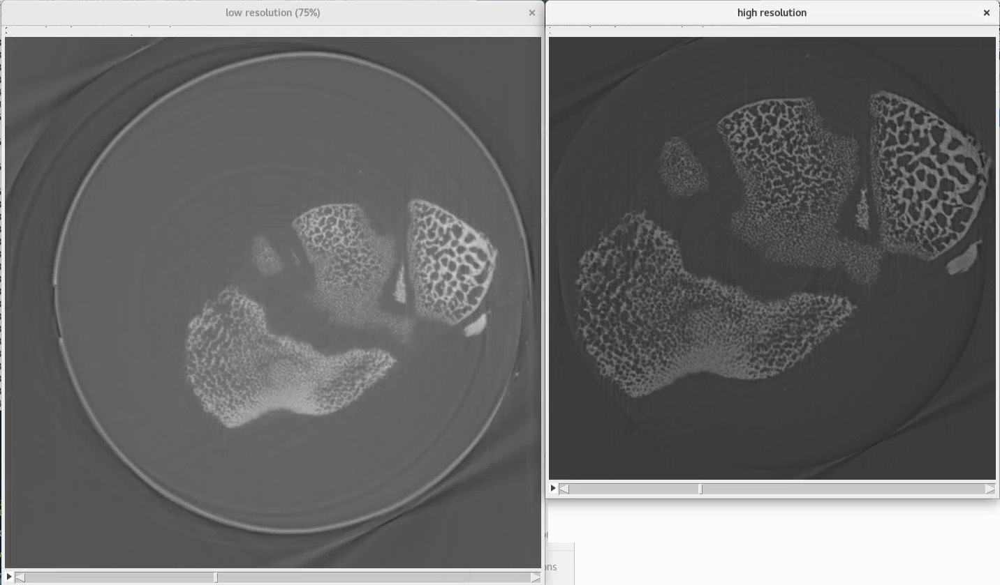
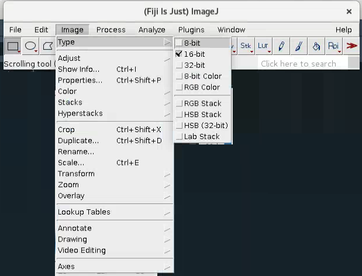

TomoSAXS: Multimodal X-ray analysis of collagenous tissues combining micro-CT and volumetric SAXS
=======================

.. _Overview:

Overview
------------
TomoSAXS is a framework for combining micro-CT and tomographic SAXS (small angled X-ray scattering) data, 
to spatially analyse nanoscale structural and strain/pre-strain in soft collagen organs using SAXS, and 
compare with micro-scale structure and strain/pre-strain estimated from micro-CT. All data is originally 
obtained at the Diamond Light Source synchrotron (`DLS <https://www.diamond.ac.uk/Home.html>`_), and the pipeline is currently 
formatted for the data structure applied by DLS.

The TomoSAXS pipeline principally operates in the Python (v = 3.10) platform, using cluster computing in the SLURM environment. 
The pipeline is modular, operating along the following modules:

  **1.	Fibre orientation analysis and SAXS/CT data registration.**

  **2.	DVC analysis of CT data.**

  **3.	Background correction using estimates of sample thickness per-rotation (from registration process).**

  **4.	Initial estimation of scattering intensity for individual fibres using single value decomposition (SVD).**

  **5.	Reconstruction of scattering metrics for individual fibres related to nanoscale structure and mechanics.**

  **6.	Spatial mapping of per-fibre metric values and estimation of per-fibre strain through comparison with DVC data.**

This document focusses on how to perform the Python pipeline for TomoSAXS processing and analysis (Modules 1,3,4,5). Details of the algorithms involved in each module are provided in the following pages:

  •	For details on Fibre Orientation processing and analysis – see LINK TO FIBRE TRACING PAGE

  •	For details on data registration – see `here <https://github.com/himadri111/saxs-docs-tutorial/blob/main/docs/source/coreg.rst>`_

  •	For details on background correction - see `here <https://github.com/himadri111/saxs-docs-tutorial/blob/main/docs/source/bgrcorr.rst>`_

  •	For details on initial estimation of per-fibre scattering intensity – see LINK TO SVD PAGE

  •	For Reconstruction of per-fibre scattering metrics – see `here <https://github.com/himadri111/saxs-docs-tutorial/blob/main/docs/source/recon.rst>`_

  •	For details on DVC processing and analysis – see LINK TO DVC PAGE

  •	For details on spatial mapping and strain estimation – see LINK TO MAPPING PAGE

To download the necessary scripts, visit the stable build library at LINK TO SCRIPTS PAGE.
Once downloaded, copy to the desired working folder for your analysis. The “folder_swap.py” script is a useful tool for changing the input folder in downloaded scripts.

.. _Module 1:

Module 1: SAXS/CT data registraion
------------
This module operates over several discrete processing steps:

 **a.	Processing of CT data.**

 **b.	Processing of fibre orientation data.**

 **c.	Registration of fibre orientation and SAXS data.**

**a.	Processing of CT data**

For imaging large samples such as complete intervertebral discs, two CT scans are used; 
 
 **a) a high resolution scan including the entire sample;**

 **b) a low resolution scan including the sample and at least one half of the kapton tube sample holder.** 
This is to allow the low resolution scan to calibrate the distance of the sample from the kapton tube in the high resolution scan (used for fibre orientation analysis and DVC), which is vital for the registration process. The scans are then combined by scaling each to that they are the same size, calculating the vertical offset between them using a suitable fiducial marker in the sample, and using the spatial offset between the marker in each scan to centre the high resolution data onto the low resolution data.

**FIG. 1. low versus high resolution SRCT reconstructions.** 

This process follows the following steps:

*Scaling CT data.* The high resolution and low resolution CT reconstructions are opened in imageJ/Fiji (herein referred to as `Fiji <https://imagej.net/>`_), by locating their folder and dragging the folder icon into the Fiji taskbar. Once loaded, reduce the bit-rate to 8bit by selecting Image>Type>8bit. Then save the 8bit version to your working directory by selecting File>Save As>Image Sequence. In the proceeding “Save Image Sequence” window, select the “Browse” button. Navigate to your working directory and create a new subfolder, naming it “CT data”. Within “CT data” create a further subfolder called “low res” if you are saving the low resolution scan, or “high res” if you are saving the high resolution scan. Finally create a final subfolder called “8bit original”. Navigate inside this new folder and hit the “select” button. Then in the “Save Image Sequence” window, delete the information in the sub-window next to “Name” and hit the “OK” button. Repeat this for each dataset.

**FIG. 2. downsampling to 8bit in Fiji.** 

