Background Corrections
=======================

.. _Overview:

Overview
------------
Describes the steps in normalising and subtracting the background for a sample in cylindrical Kapton tube. Background correction is based on the `Adcorr <https://github.com/DiamondLightSource/adcorr>`_ library developed for background correction of SAXS data collected at the I22 beamline of the Diamond Light Source synchrotron.

TomoSAXS samples have background SAXS signals from two main sources:

  1. Cylindrical kapton tube ("Background")

  2. Phosphate buffer solution (PBS) ("Dispersant")

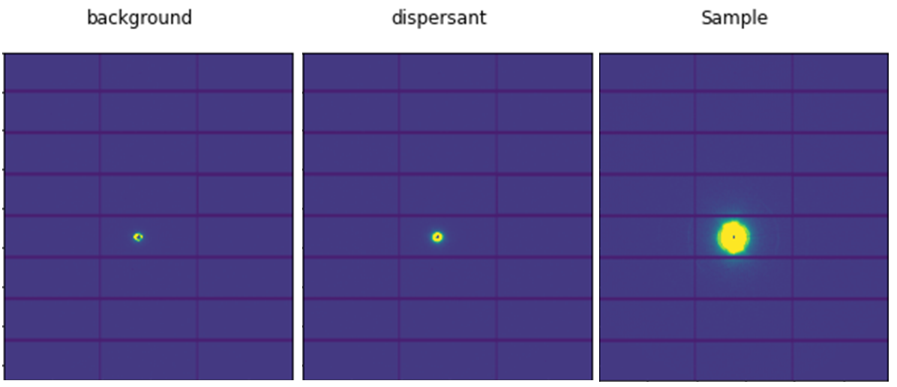

Background correction for tomoSAXS samples is complicated by several factors:

  1. The cylindrical shape of kapton tubes changes the proportion of scattering background (amount of PBS solution per-beampath

  2. The non-uniform shape of samples changes the proportion of PBS displaced b ythe sample both between beampaths and between rotations.

These factors must be accounted for when applying the Adcorr background correction procedure on tomoSAXS data. 

This technique accounts for these factors by:

  1. Using the known diameter of the kapton tube to estimate the thickness of the tube and thus the amount of undisplaced PBS in every beampath.

  2. Estimating the thickness of the sample for every beampath of the tomoSAXS scan during the co-registration `Co-registration <https://himadri111-saxs-docs-tutorial.readthedocs.io/en/latest/coreg.html>`_ process.

These values allow estimation of the displaced volume fraction for every frame of the tomoSAXS scan.

Prerequisite data:
^^^^^^^^^^^^^^^^^^

1. TomoSAXS dataset: series of individual SAXS raster map files and associated data (accessed using .nxs file) representing each of the tomoSAXS orientations.

2. Mask file: File ( Figure :ref:`svfit-label` ) created during calibration of experiment at I22 beamline identifying regions of 2D SAXS frames to be masked from analyses.

3. Calibration file: filecreated during calibration of experiment at I22 beamline containing calobration data for analysis of 2D SAXS frames.

4. Background file: raster map acquired using the same parameters as tomoSAXS data taken of an empty kapton tube (diameter the same width as that used in the respective tomoSAXS scan).

5. Dispersant file: raster map acquired using the same parameters as tomoSAXS data taken of a kapton tube (diameter the same width as that used in the respective tomoSAXS scan) filled with hydrating fluid used in tomoSAXS scan (e.g. PBS/phosphate buffer saline solution).

6.Sample thickness file: file containing data for the estimate thickness of the sample across every beampath in the tomoSAXS scan. Can be either a .txt file or .npy file (.npy preferred). Generated as part of the `Co-registration <https://himadri111-saxs-docs-tutorial.readthedocs.io/en/latest/coreg.html>`_ process. .npy file is saved as a 3D arary; first dimension for tomoSAXS orientation; second dimension for tomoSAXS slice; third dimension for estimated sample thickness for each frame. 

7. "tomoSAXS_disp_multiproc": library python file for multiprocessing of background correction data.

Steps:
^^^^^^^

1. User input folder and scan  parameters (tomoSAXS files, output directories, type of scan, kapton width etc).

2. Load background and dispersant data

3. Load sample thickness data

4. for each scan: 

  a. Load SAXS data slice by slice and estimate position of kapton edges.

  b. Use these estimates to estimate the thickness of the kapton tube at each beampath.

  c. Use the estimated sample thickness for the same beampath to in-turn estimate the amount of PBS displaced by the sample for the beampath.

  D. Input these values into the `pauw_dispersed_sample_sequence() <https://github.com/DiamondLightSource/adcorr/blob/main/src/adcorr/sequences/pauw.py>`_ function for this frame to perform the background correction.

5. Save corrected data in new hdf5 file.

.. _gui:
1. User input
--------------

User input is performed using a series of graphical user interfaces (GUIs), where the user inputs the correct folders, files, and scan parameters for the background correction process.

The first:

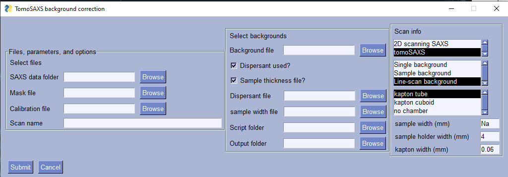

Reads in:

a. "SAXS data folder" - the folder containing the tomoSAXS data.

b. "Mask file" - the "SAXS_mask.nxs" file for the respective experiment.

c. "Calibration file" - the "SAXS_calibration.nxs" file for the respective experiment.

d. "Scan name" - name for scan to use for saving backgroudn corrected files (if left empty then saves the same names as the individual tomoSAXS scan names).

d. "Background file" - the .nxs file for the empty kapton tube SAXS raster map.

e. "Dispersant used?" - tick box to state that a dispersant file should be used in the background correction. Creates new file selection box to select the .nxs file for the pbs-filled kapton tube raster map.

f. "Sample thickness folder?" - tick box to state that a sample thickness file should be used in the background correction. Creates new file selection box to select the file.

g. "Script folder" - the folder containing the python file "tomoSAXS_disp_multiproc" python file.

h. "Output folder" - the folder chosen for outputting background corrected data for.

"Scan info" - three check boxes for the nature of the scan. for tomoSAXS, select:

  "tomoSAXS"

  "Line-scan background"

  "kapton tube"

Then input the respective values for the kapton tube and gross sample thickness.

The second:

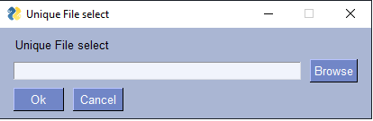

Reads in the nexus files for each of the individual raster maps that make up the respective tomoSAXS scan.

.. load_data:
2. Loading data
----------------

The script starts by loading the data for the the background (empty kapton tube) and dispersant (filled kapton tube) data. The outputs (not shown during the script) are: 

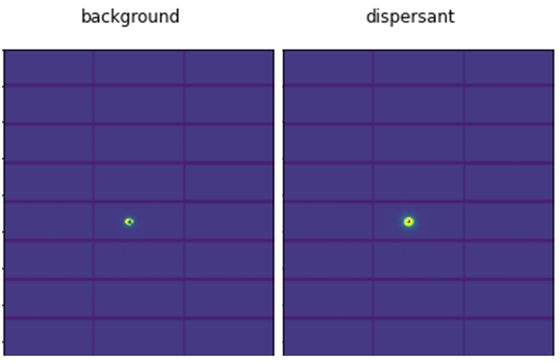

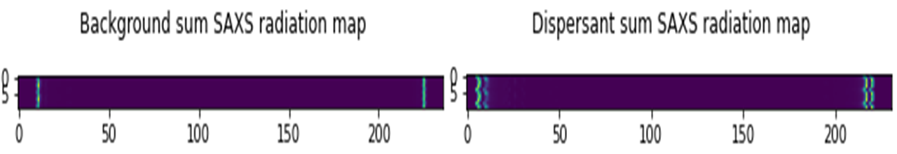

Data types loaded for all datasets (background, dispersant, and sample) are:
  i.   Frames (2D SAXS detector frames)
  ii.  Count times (exposure time in seconds for each frame)
  iii. Incident flux (I0 data for each frame)
  iv.  Transmitted flux (bs diodes data for each frame)

and the Sample thickness data:

JAGGED REGIONS ARE ARTEFACTS - MUST BE CORRECTED WITH FIND PEAKS/SMOOTHING ETC

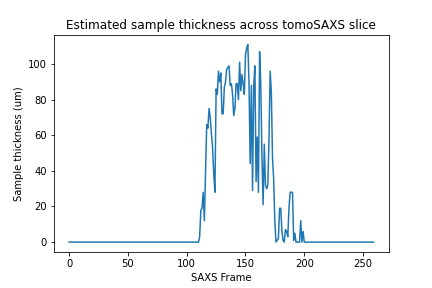

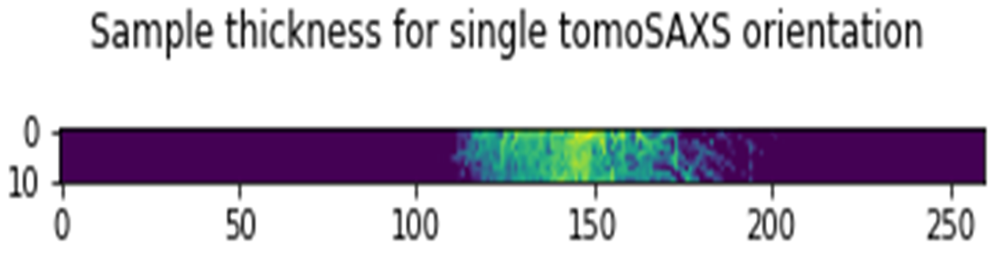

and finds the edges of the kapton tube for both datasets:

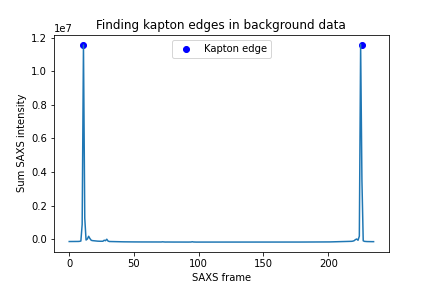

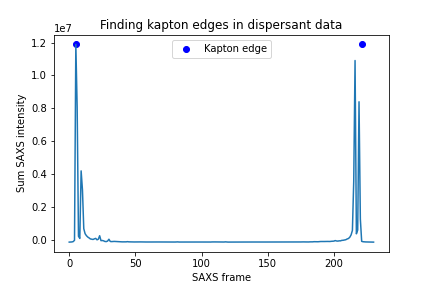

The script then loads the mask:

.. _mask-label:
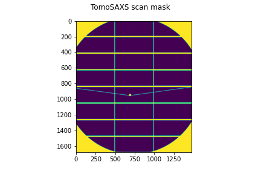

and calibration data for the tomoSAXS scan.

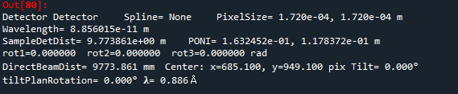

.. bg_corr:
3. Background correction
-------------------------

Background correction is performed on a per-scan basis for tomoSAXS (i.e. each individual raster map representing a sequential sample orientation is loaded individually and backgroundcorrected). For each scan, backgroudn correction is also applied on a per-slice basis. Each vertical slice is loaded sequentially, and for each slice:

a. the kapton tube edges are found

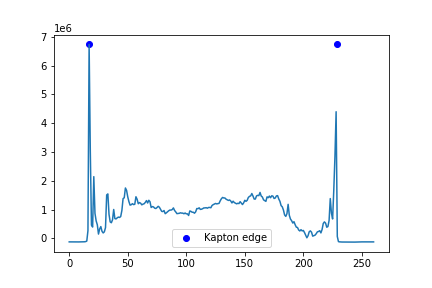

b. The data for the sample:
  a. SAXS frames
  b. Count times
  c. Incident flux (I0 data)
  d. transmitted flux (bs diodes data)
  e. Sample thickness data for this slice
are then subsampled to just those frames within the kapton edges

c. The X axis positions are found for each of these frames, and the difference between these positions and the lefthand-side (lhs) kapton edge are used to subsample the frames, count times, incident flux values, and transmittedflux values  from the equivalent position of the kapton tube width for the background and dispersant data.

d. The width of the kapton tube can then be estimated for each frame by estimating the chord length of the frame from its distance from the centre point of the tube:

.. code-block:: python

  disp_sample_range = sample_axis[-1]-sample_axis                
  disp_dist_frm_ctr = np.sqrt((disp_sample_range-(disp_sample_range[0]/2))**2)                
  choord_len = [((disp_dist_frm_ctr[0]**2)-(disp_dist_frm_ctr[k]**2))*1000 for k in np.arange(0,len(disp_dist_frm_ctr),1)]
  choord_len = np.asarray(choord_len)*1e-3

e. We can then input the subsampled data (frames, count times, incident flux, transmitted flux), as well as the estimated kapton tube width, and estimated sample width, and original index (position within the scan) for every subsampled frame into the "tomSAXS_disp_mutliproc()" multiprocessing function. This function uses multiprocessing to apply the `pauw_dispersed_sample_sequence() <https://github.com/DiamondLightSource/adcorr/blob/main/src/adcorr/sequences/pauw.py>`_ function to background correct each subsampled frame, using the ratio between the sample thickness and kapton tube width as a metric for the displaced volume fraction.

f. For each frame, this function outputs a background corrected frame, and its original index:

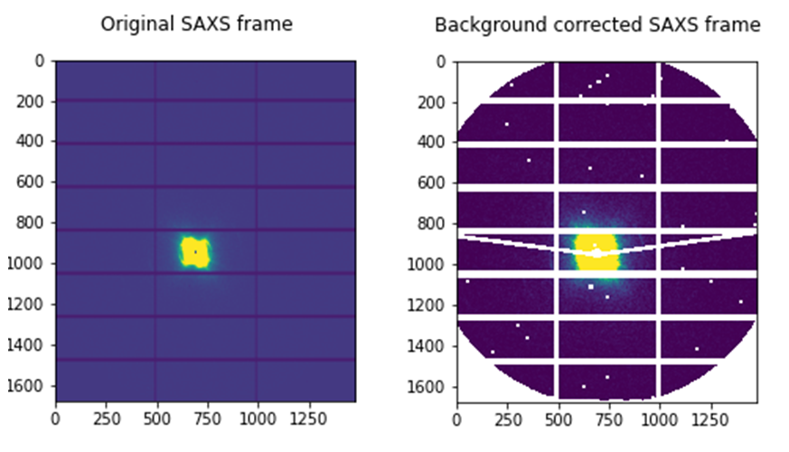

.. image:: Iq_comp.png

e. Input subsampled values for:
  i.   frame index (index of the subsampled frame within the original tomoSAXS slice)
  ii.  sample frames (subsampled frames within the kapton tube)
  iii. background frames (subsampled background frames within the kapton tube)
  iv.  dispersant frames (subsampled dispersant frames within the kapton tube)
  

.. _gui:
Loading Data

Summarize folder structure, needed files (including calibration), sample file, water bgr, empty kapton bgr, empty air bgr, input file locations, ...

.. _principles:
Principles of Background Corrections
--------------
Summarize relations in A. Smith et al J. App. Cryst. (2017)
(Primary responsibility: EN/HG)
Summarize equations

Load SAXS scans along with background files and apply adcorr correction
  a. Theory behind absorption corrections in variable geometries
  b. Example usage with experimental data
  c. Example usage with simulated data
    i. Using `pyFAI <https://pyfai.readthedocs.io/>`_ to generate synthetic data

.. _variablethickness:
Accounting for variable thickness with CT image
------------------
(Primary responsibility: EN with input from AP/JC). Code examples

.. _examplesim:
Simulated data examples
--------------------
Linescan of tissue plane with small voxel size in saline/PBS

.. _exampleexp:
Experimental data examples
--------------------
Linescan of tissue plane from experimental data in saline/PBS
