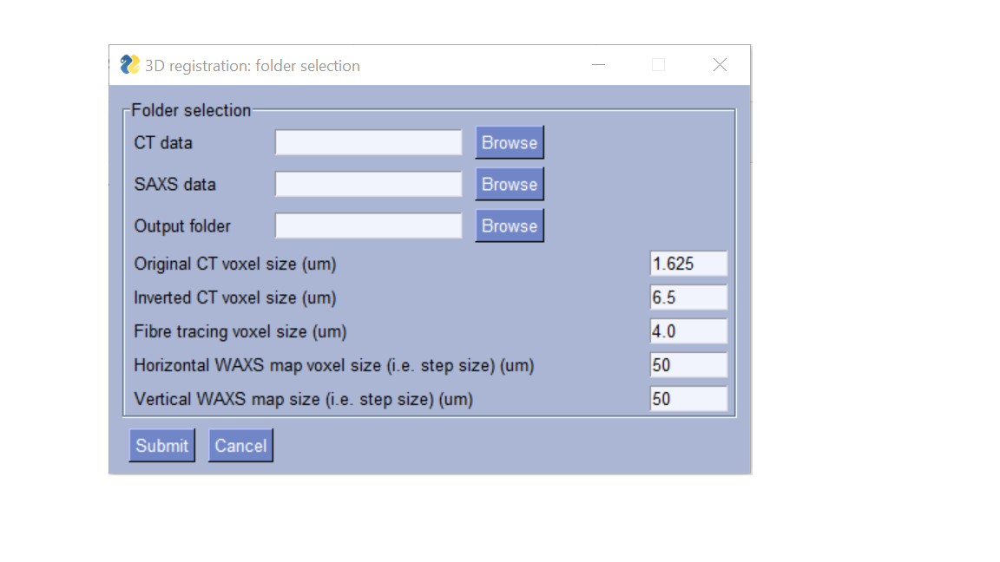

CT to SAXS volume coregistration
==================================

.. _Overview:

Overview
------------
Describes the steps in aligning the CT 3D image to the SAXS maps, including fixing coordinate system, downsampling of CT to SAXS voxel size, parameters from CT per SAXS voxel.

Prerequisite data:
a. TomoSAXS dataset.
b. Coarse SAXS mapping dataset of the respective sample (per-frame sum SAXS scattering).
c. CT dataset.
d. Resliced and inverted copy of CT dataset at same orientation as coarse WAXS map (See CT Processing page - [update to hyperlink once page complete]).
e. Segmentation dataset of kapton tube (from CT data)
f. Fibre tracing dataset of CT data (volumetric dataset with greyscale values corresponding to estimated 3D collagen fibre orientations).

Steps are:
1. Register vertical axis between resliced CT dataset and coarse mapping of tomoSAXS dataset.
  Registration uses the offset between vertebrae end-points surrounding the respective IVD.
  The offset is provided with absolute values from coarse SAXS map. 
  This calibration also allows estimation of which CT slices represent the regions investigated in the tomoSAXS scan.

2. Register horizontal axis between CT dataset and tomoSAXS dataset.
  This process uses a seperate volume taken from the original CT volume, consisting of a segmented region of the kapton tube surrounding the sample.
  This volume is subsampled, alongside the  fibre-tracing dataset, to slices comprising the tomoSAXS scanned region.
  The data (both kapton segmentation and fibre tracing data) is rotated to correspond to each angular rotation of the tomoSAXS scan (e.g. -900 – 00 – 900).
  For each rotation, the kapton segmentation is treated as a coord, to estimate the complete extent of the kapton tube as a circle. The space between the inside edges of the kapton tube and the traced fibres is estimated (in um).
  This information is then used to calibrate the horizontal registration between fibre tracing and SAXS data.

3. Tagging/dictionary of SAXS frames for each fibre, in each orientation
	A python dictionary is created, consisting subheadings for each scanning orientation 

.. load_data:
Loading data
------------

Data for each scan is loaded using a series of GUIs.

the first:

reads in:
a. The CT folder for the scan that should contain:
  i. Fibre tracing data
  ii. Inverted reslice of CT data
b. The nexus file for the coarse tomoSAXS map
c. The output folder for the registration data
d. The voxel size of the original CT data
e. The voxel size of the inverted CT data (may be adjusted if processed on a laptop due to limited computing power)
f. The voxel size of the fibre tracing data (downsampled as part of the process)
g. Horizontal WAXS map voxel size
h. Vertical WAXS map voxel size

the first:

Allows selection of individual files that make up the tomoSAXS scan.

.. vert_reg:
1. Vertical registration
---------------------
1.a. Load WAXS sum intensity map. 

1.b. Use k-means clustering (with a custer count of 5) to segment bone.

1.c. Find sample midpoint along X-axis as point of lowest mean WAXS scattering intensity between kapton edges.

1.d. for an ROI of +/- 10 pixels around this point, isolate coordinates of pixels whose clustered grey-scale values do not correspond to bone:
.. image:: midpoint WAXS.png
  :width: 400
  :alt: Alternative text

1.e. The endpoint of the upper vertabra is designated as the highest point at which these pixels start; and the endpoint of the lower vertebrae
     as the lowest point at which they end.
     The "base_y_value" dataset in the WAXS hdf5 file provides the absolute axis coordinates for these endpoints.

1.f. Now, the inverted and resliced CT data is loaded:
.. image:: raw inverse CT.png
  :width: 400
  :alt: Alternative text

1.g. and also clustered (using 5 clusters)
.. image:: clustered inverse CT.png
  :width: 400
  :alt: Alternative text

1.h. The same steps are repeated to find the endpoint of the upper vertabra in the CT data.

.. _coordinates:
Coordinate systems
-------------------
Coordinate systems for CT and SAXS. related Figures

.. _downsampling:
Downsampling 
------------------
1. Method of downsampling, code example
2. Regular grid or cluster; where this is selected for in code

.. _parameters:
CT parameters
--------------------
Direction of orientation and degree of orientation per voxel or fibre cluster. related: 3D SAXS simulation of fibre with variable wMu
