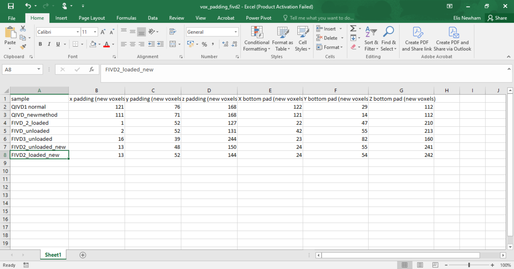

CT to SAXS volume coregistration
==================================

.. _Overview:

Overview
------------
Describes the steps in aligning the CT 3D image to the SAXS maps conducted for each orientation of a tomoSAXS scan, including fixing coordinate system, downsampling of CT to SAXS voxel size, parameters from CT per SAXS voxel. 

The TomoSAXS technique proposes the spatial registration of independently acquired CT and volumetric SAXS datasets of soft collagen tissues. CT data is processed and analysed using the fibre tracing technique to isolate individual collagen fibres and estimate their three-dimensional (3D) orientations. This information is then used to isolate the signal of individual fibres in SAXS data. 

TomoSAXS scans are acquired by rotating a sample over a set number of orientations over a complete 180 degree rotation. Each orientation is represented by a two dimensional raster map of SAXS frames, that includes the edges of the kapton tube around the sample. 

The centre of this rotation is independent to the rotation of the corresponding CT scan from-which fibre orientations are estimated (that also includes as much of the kapton tube as possible given the voxel size ofthe CT scan). 

These datasets must be registered both vertically and horizontally, for each raster map representing each orientation of the tomoSAXS scan, in order for the identity of isolated fibres in CT data to be consistently retained through the tomoSAXS scan. 

Prerequisite data:

a. TomoSAXS dataset: series of individual SAXS raster map files and associated data (accessed using .nxs file) representing each of the tomoSAXS orientations.

b. Coarse WAXS mapping dataset of the respective sample (per-frame sum WAXS scattering): Each tomoSAXS scan starts with a coarse mapping of the sample, oriented at the midpoint of the tomoSAXS scan (i.e. if the scan is roated between -90 and 90 degrees - the map is taken at 0 degrees). While this map is initially used to pinpoint the rgeion of interest (ROI) within the sample for the tomoSAXS scan - it is used here for vertical registration with the CT data. 

c. CT dataset: Reconstruction of the CT data set of the respective sample

d. Resliced and inverted copy of CT dataset at same orientation as coarse WAXS map (See CT Processing page - [update to hyperlink once page complete]).

e. Segmentation dataset of kapton tube (from CT data). A copy of the original CT dataset, with the kapton tube segmented from the rest of the data - leaving a binary dataset consiting of the only the kapton tube and background. 

f. Fibre tracing dataset of CT data (volumetric datasets with greyscale values corresponding to estimated 3D collagen fibre orientations). This consists of two seperate folders containing alpha (called theta in the fibre tracing process), and beta (called phi in the fibre tracing process) values for traced fibres (respectively).

g. Fibre tracing "vox_padding" excel file - used for padding of fibre tracing data. NB - the names given to tomoSAXS scans in this file are used verbatim in this registration process.

Steps are:

1. Register vertical axis between resliced CT dataset and coarse mapping of tomoSAXS dataset.
  
  Registration uses the offset between vertebrae end-points surrounding the respective IVD.
  
  The offset is provided with absolute values from coarse SAXS map. 
  
  This calibration also allows estimation of which CT slices represent the regions investigated in the tomoSAXS scan.

2. Pad fibre tracing data.
  
The Fibre tracing technique sumsamples and downsamples original CT data. This process adds empty voxels to fibre tracing data so that the fibre tracing data returns to the same dimensions as the original CT data.
  
  Padded data can then be registered with SAXS data both `vertically <.. vert_reg:>`_ and horizontally.
  
  The padded fibre tracing slices that vertically correspond to the slices of the tomoSAXS scan are then isolated and saved.

  The kapton data that correspond to these slices are also isolated and saved.

3. Register sample axes (-90/90 degree; 0/180 degree) of padded fibre tracing data using the kapton segmentation, and preprocess fibre data. 

  This step pre-processes the padded fibre tracing data to align it with the major axes (0/180; -90/90) of the tomoSAXS scan, before 
  registering voxels for each tomoSAXS orientation (step 4). The coarse WAXS maps are conducted at 0 degreess. The CT reconstructions 
  are also oriented with the Y axis corresponding to -90/90 degrees, and X axis corresponding to 0/180 degrees. Thus, the Y axis of 
  the kapton segmentation corresponds to the first orientation of the tomoSAXS scan, and the X axis to the midpoint orientation. The 
  offsets for each axis are calculated by comparing the positions of the left-hand-side (lhs) kapton edge along both axes in the CT 
  and SAXS data. The fibre tracing data and kapton data is then padded accordingly to overcome these offsets. 

  The preprocessing step here uses K-means clustering to assess the heterogeneity of orientation values for fibres sampled within 
  each tomoSAXS voxel. In a single tomoSAXS voxel, fibres with values within 5 degrees of each other are determined to be 
  insufficiently independent in terms of their angular orientation to be able to seperate using tomoSAXS. So they are given the same 
  mean value and indexed as the same scattering object.  

4. Register horizontal axis between padded fibre tracing data and SAXS data for each orientation in tomoSAXS scan, and subsample across tomoSAXS beampaths. 

This process repeats the kapton edge offset calculation from step 3 to register the fibre tracing and SAXS axes (only x axis for this step as this is the axis that the SAXS mapping is conducted over), but for each orientation in the tomoSAXS scan. For the first orientation, the alpha and beta values for fibres are subsampled into the tomoSAXS voxels within-which they are found. The fibre data within these subsampled voxels are then indexed. Index data is then rotated alongside fibre tracing data forthe rest of the scan, allowing the identity of traced fibres to be consistently identified.   
  
5. Save data.

The data outputted from this process is saved, both as python objects and legible formats for humans.

.. load_data:
Loading data
------------

Data for each scan is loaded using a series of GUIs.

the first:

.. image:: final_gui.png

reads in:

a. "Scan name" - the name given to the tomoSAXS scan in the accompanying fibre tracing "vix_padding" excel file.

b. "Original CT data" - the folder containing the original CT data.

c. "Inverted resliced CT map" - the file comprising the resliced, grayscale inverted CT map corresponding to the coarse WAXS map used for registration.

d. "Kapton CT dataset" - the folder containing the segmented kapton tube data.

e. "Beta/phi fibre tracing data" - the folder containing the (original unpadded) beta/phi fibre tracing data.

f. "Alpha/theta fibre tracing data" - the folder containing the (original unpadded) alpha/theta fibre tracing data.

g. "WAXS map data" - the .nxs file of the coarse WAXS map. 

h. "Output folder" - the folder that the user wishes to output data generated by the registration script (example figures and tables).

i. "Original CT voxel size (um)" - The voxel size of the original CT data in microns.

j. "Inverted CT voxel size (um)" - The voxel size of the inverted CT data (may be adjusted if processed on a laptop due to limited computing power).

k. "Kapton data voxel size (um)" - The voxel size of the kapton segmented data (may be adjusted if processed on a laptop due to limited computing power).

l. "Fibre tracing voxel scale" - The downsampling scale used for fibre tracing data creation.

m. "Kapton tube diameter (um) - diameter of kapton tube in microns.

n. "SAXS rotational direction" - direction of rotation for tomoSAXS scan.

the second:

.. image:: saxs_select_GUI.png
  :width: 400

Allows selection of individual files that make up the tomoSAXS scan.

the third:

.. image:: saxs_scan_gui.png

Reads in:

a. "Number of rotational angles in tomoSAXS scan".

b. "start angle" - axis orientation of the first orientation of the tomoSAXS scan.

c. "end angle" - axis orientation of the last orientation of the tomoSAXS scan.

d. "angle of WAXS map".

.. vert_reg:
1. Vertical registration
---------------------
1.a. Load WAXS sum intensity map. 

.. image:: WAXS_map_scaled.png

1.b. User selects endpoint of the upper vertebra in WAXS data.

.. image:: WAXS_map_top_vert_endpoint.png

1.c. Now, the inverted and resliced CT data is loaded:

.. image:: raw_inverse_CT.png

1.d. and user selects endpoint of the upper vertebra in CT data.

1.e. The offset between the vertebral endpoint and the tomoSAXS slices can now be calculated by loading the first orientation of the tomoSAXS scan, and comparing the y axis coordinates of each slice with that of the vertebral endpoint:

.. image:: CT_map_with tomoSAXS_slices.png

.. padding:
2. Padding of fibre tracing data
--------------------------------

For both the Beta/phi fibre tracing data; and alpha/theta fibre tracing data: 
2.a. Load fibre tracing data. 

2.b. Load padding values from the "vox_padding" excel file.

2.c. Create empty arrays with shapes corresponding to the padding dimensions and concatenate with fibre tracing data:

.. image:: Example_alpha_fibre_tracing_tomoSAXS_slice_0.png

2.d. Isolate and save padded fibre tracing slices that correspond to tomoSAXS slices.

2.e. Save corresponding kapton tube slices that also correspond to tomoSAXS slices.

.. xy_regg:
3. Registering sample coordinates
---------------------------------

3.a. Load the fibre tracing data (alpha and beta), and kapton data that corresponds to the topmost tomoSAXS slice.

3.b. Use Canny edge transformation to isolate outer edge of Kapton tube in kapton data (the outer edge is the most prominent edge in SAXS data).

3.c. Fit a circle to the outer edge using the Coope method (nsphere_fit from skg library), and find the lhs extreme of this circle across the x axis (0/180 degrees) and y axis (-90/90 degrees). Convert these edge coordinates into absolute spatial values using the fibre tracing voxel size.

3.d. Load the sum SAXS radiation data for the midpoint orientation of the tomoSAXS scan (0 degrees).

3.e. Isolate the lhs outer kapton edge in the SAXS data and convert to absolute spatial values using the tomoSAXS voxel size.

3.f. Repeat steps 3.d-e for the first orientation of the tomoSAX scan (-90 degrees).

3.g. We can now calculate the absolute offset along both the -90/90 degree and 0/180 degree axes betwen tomoSAXS and CT data for the sample by subtracting the edge value in CT data from the edge value in SAXS data. the Offset will be positive if the SAXS edge is tothe right of the CT edge, and negative if the SAXS edge is tothe left of the CT edge (along the respective axis).
  math portion here.

3.h. We now need to overcome these offsets, and pad the fibre tracing data to the same size as the tomoSAXS data (tomoSAXS scans typically larger in absolute size than CT reconstructions). The most obvious method for doing this would be to, for each axis: pad the CT along the axis if the kapton edge is to the left of the SAXS data; and clip it if it is to the right of the SAXS data - then pad to be the same size as the SAXS data along this axis. 

BUT clipping CT data risks removing impotant fibre tracing data. So we must instead first pad the fibre tracing data to be the same size as the SAXS data along the axis - then pad again by the absolute overlap value - regardless of the overlap direction.

If the original overlap value is positive - then the padding has overcome the offset along this axis and the data is now registered along this axis and we can sample across the axis.

If the original overlap is negative - then we must sample the padded data starting from DOUBLE the absolute overlap value to register the SAXS and Ct data. 

3.i. Repeat step 3.h. for kapton data.

3.j. Perform pre-processing on fibre data based on the heterogeneity of angular orientations:
  i.   Create a new empty matrix the same size as the fibre data matrix.
  i.   Calculate the coordinates across the fibre tracing data that correspond to the tomoSAXS voxels.
  ii.  Within each tomoSAXS voxel coordinate system, sample the fibre data.
  iii. Apply K-means clustering to identify "clusters" of fibres with beta values within 5 degrees of each other.
  iv.  Label the clusters.
  v.   Repeat iii-iv for alpha data.
  vi.  Identify where/if the two clustered voxels differ - indicates that one orientation metric differs more than the other and so 
       both datasets should be reclustered according to the metric with the highest variation.  
  v.   Copy the clustered, reassigned data onto the same coordinates of the empty matrix and change the mean value to a unique index 
       value (thus creating an index matrix).
  
  This creates a new dataset of registered fibre tracing voxels, with "clustered" fibre values for the alpha and beta fibre tracing 
  datasets - which can be used in the registration and subsampling of the full tomoSAXS scan.  

.. scan_reg:
4. tomoSAXS scan registration
------------------------------

For each orientation of the tomoSAXS scan:

4.a. rotate the padded kapton data and padded, clustered alpha data, and beta data to the correct orientation (rotate function from scipy.ndimage - eshape set to false; mode set to "nearest"; order set to 0 - to stop values being changed through the interpolation). 
  i.  If this is the first orientation of the tomoSAXS scan - copy the rotated alpha data into a new dataset for indexing the data; 
      and a new dataset for indexing the tomoSAXS voxels.
  ii. If this is any of the proceeding orientations - also rotate the fibre index data and tomoSAXS voxel index data created for the 
      first orientation.
  
4.b. Load the sum SAXS radiation data for the raster map representing this orientation.

4.c. Identify the outer edge of the lhs kapton tube edge in the sum SAXS data.

4.d. Find outer edge of lhs kapton tube edge in CT data.

4.e. Calculate offset between CT and SAXS data along X-axis (Y-axis is not included here as we only sample the SAXS data across the X-axis of the CT data and it is averaged over the CT Y-axis). Due to the pre-registering (Section 3), this offset should be 0 for the first and midpoint orientations.

4.f. Pad rotated alpha, beta, and index data following step 3.h.

4.f. Calculate the X-axis coordinates across the fibre tracing data that correspond to the tomoSAXS voxels.

4.g. Create: 
  i.   A new map of tomoSAXS voxels for per-tomoSAXS voxel fibre alpha values.

  ii.  A new map of tomoSAXS voxels for per-tomoSAXS voxel fibre sizes (number of fibre tracing voxels that represent the respective 
       fibre).

  iii. A new map of fibre tracing voxels for indexed fibres (each fibre represented by its index value instead of orientation value).

  iv.  A new map of fibre tracing voxels for tomoSAXS voxel index (each fibre tracing voxel given a value referencing the tomoSAXS 
       voxel it belongs to).   

  v.   A new map of tomoSAXS voxels for tomoSAXS voxel index (index of the respective tomoSAXS voxel).

  v.i. A new map of tomoSAXS voxels for indexed fibres.

4.g. If this is the first orientation - 

  i.   The tomoSAXS voxels should already be registered with the clustered alpha and beta data -  
       so subsample the alpha data across these tomoSAXS voxels and list the value of fibres in the respective voxel of the 4.g.i. 
       map; and the voxel counts of the fibres (the number of fibre tracing voxels that make up the fibre within the respective 
       voxel) in the respective voxel of the 4.g.ii. map.

  ii.  Index the clustered fibres in each tomoSAXS voxel; apply the index value to the fibretracing voxels that represent the indexed 
       fibre; and save indexed voxels in the 4.g.iii. map.

  iii. Index the tomoSAXS voxels and save to map 4.g.v.  

  iv.  Index the fibre tracing voxels making up each indexed tomoSAXS vixel by the index of the tomoSAXS voxel. Save to map 4.g.iv.

  v.   Re-register the fibre tracing voxel map of indexed fibres (map 4.g.iii) with the tomoSAXS voxels to create a new tomoSAXS map 
       consisting of lists of fibres found within each tomoSAXS voxel.

  vi.  Repeat steps 4g.i-ii. for beta data

     Else, if this is not the first orientation - 

  i.   Calculate the fibre tracing voxels that correspond to the tomoSAXS voxels in the padded, rotated fibre tracing data due tothe 
       offset between the two datasets.

  ii.  Using the rotated fibre index map, register the index of fibres within each tomoSAXS voxel. Save the registered lists for each 
       tomoSAXS voxel to map 4.g.vi.

  iii. Using the rotated index map, register the alpha values of indexed fibres within each tomoSAXS voxel. Save registered lists for 
       each tomoSAXS voxel to map 4.g.i.

  iv.  Using the rotated index map, register the number of fibre tracing voxels that comprise each indexed fibre within each tomoSAXS 
       voxel. Save registered lists for each tomoSAXS voxel to map 4.g.ii.

  v.   Repeat for Beta values.

4.h. Save maps for each tomoSAXS slice, for the respective rotation in nested list.

.. scan_reg:
5. Save registered data
------------------------

We can now save the registered and indexed data for each orientation of the tomoSAXS scan. This is saved as a numpy opbject for further processing and anlysis by the tomoSAXS pipeline, and as dataframes for human/qualitative analysis and archiving.

For each dataset (nested list of orientations and tomoSAXS slices):

5.a. Save complete object as numpy file.

5.b. Split dataset into its constituent orientation.

5.c. Split orientation into its constituent tomoSAXS slices.

5.d. Save tomoSAXS slice as individual numpy object.

5.e. Convert slice to pandas dataframe.

5.f. Save as excel file (.xlsx).

