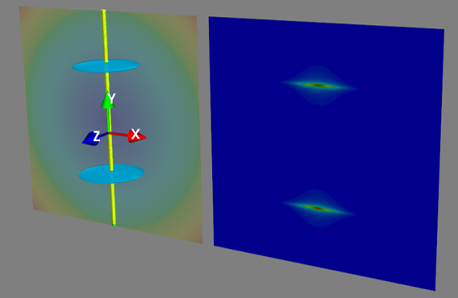
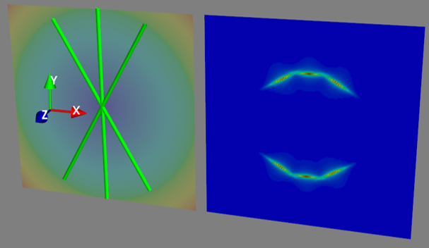

Fibre diffraction model
=======================

.. _modelbgr:

Background
------------
Summarises the 3DXRD model for collagen meridional fibril scattering. Source code is in threeDXRD.py or threeDXRD_nomlab_CURRENT.py 

.. _fibreimage:
3D and 2D SAXS scattering from fibril
--------------------------------------

:math:`I^{k}_{r}(\chi)`

The scattering from a single fibril with D-period :math:`D` and fibril radius :math:`R` is a series of ellipsoids with axial spacing :math:`2\pi/D` and width :math:`w_{p}\propto \frac{1}{R}`. This is graphically shown below

The scattering from three fibrils separated by 30 degrees is shown below; note the separated ellipsoidal streaks.

