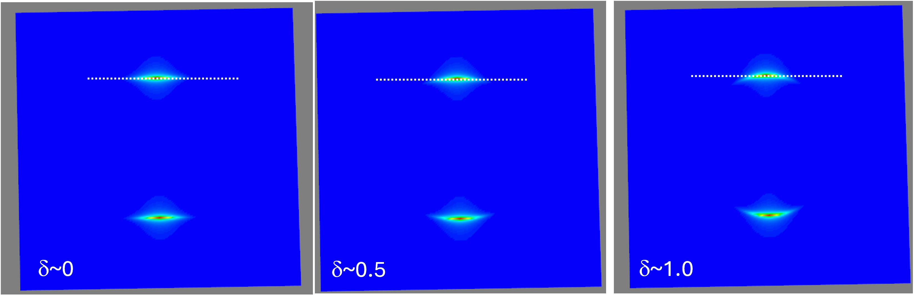

.. _section_fibre_diff:
Fibre diffraction model
=======================

.. _modelbgr:

Background
------------
The physical information about the per-voxel characteristics of the collagen fibril include a) D-period (linked to collagen pre-strain) b) fibril radius c) gap/overlap ratio of tropocollagen molecular packing and d) fibrillar disorder. The general relations are described in `S. R. Inamdar et al ACS Nano (2017) <https://pubs.acs.org/doi/full/10.1021/acsnano.7b00563>`_ and related publications. Source code is in threeDXRD.py or threeDXRD_nomlab_CURRENT.py (the second library does not use the 3D graphics package Mayavi, to simplify Python environment installation requirements). 

.. _fibreimage:
3D and 2D SAXS scattering from fibril
--------------------------------------

*Single fibrils*: The scattering from a single fibril with D-period :math:`D` and fibril radius :math:`R` is a series of ellipsoids with axial spacing :math:`2\pi/D` and width :math:`w_{p}\propto \frac{1}{R}`. This is graphically shown below

*Multiple fibrils*: The scattering from three fibrils separated by 30 degrees is shown below; note the separated ellipsoidal streaks.

*3D rotation*: If the right-hand fibres is rotated by 30 degrees out of plane, note the reduction of it's meridional peak intensity due to the reduced intersection of the meridional streak with the Ewald sphere. 

.. image:: 3Dfibril_mayavi_example3_cropped2.png
  :width: 400

*Variable curvature*: It is found experimentally that the meridional reflections can range from flat streaks (most prominenntly seen in dry collagen) to curved reflections, even for apparently uniform fibril orientations in tendons. The structural reason may be due to kinking or twisting of the molecules within the fibril or a misorientation at the microscale (since the SAXS voxel size is :math:`(20 \mu m)^3`. Underlying mechanisms may be water-associated change of conformation.

In any case, to account for this phenomenon in the model, we define a new parameter :math:`\delta` which ranges from nearly 0.0 (it can not be exactly zero for roundoff reasons) to 1.0. When nearly 0, the meridional peak is a flat streak, and as :math:`\delta` increases towards 1, the streak approaches the circular case. :math:`\delta` is a parameter included in fibril characteristics. The phenomenon is illustrated below.

Depending on how correlating information from CT (which shows both straight as well as microscopically kinked fibres) to the measured SAXS patterns works out, we may be able to decide whether to assign the flat/curved change to the microstructural level. If yes, then the level of misorientation might be able to be estimated from the CT voxels (on a per-SAXS-voxel basis), allowing :math:`\delta` to be a fixed parameter per SAXS voxel. 
