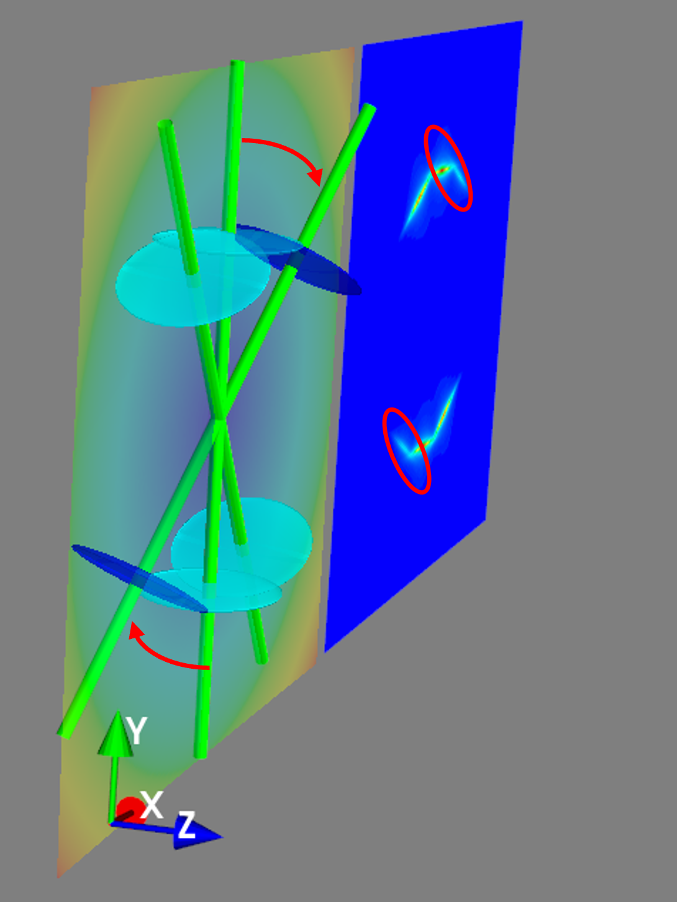

Fibre diffraction model
=======================

.. _modelbgr:

Background
------------
The physical information about the per-voxel characteristics of the collagen fibril include a) D-period (linked to collagen pre-strain) b) fibril radius c) gap/overlap ratio of tropocollagen molecular packing and d) fibrillar disorder. The general relations are described in `S. R. Inamdar et al ACS Nano (2017) <https://pubs.acs.org/doi/full/10.1021/acsnano.7b00563>`_ and related publications. Source code is in threeDXRD.py or threeDXRD_nomlab_CURRENT.py (the second library does not use the 3D graphics package Mayavi, to simplify Python environment installation requirements). 

.. _fibreimage:
3D and 2D SAXS scattering from fibril
--------------------------------------

*Single fibrils*: The scattering from a single fibril with D-period :math:`D` and fibril radius :math:`R` is a series of ellipsoids with axial spacing :math:`2\pi/D` and width :math:`w_{p}\propto \frac{1}{R}`. This is graphically shown below

.. image:: 3Dfibril_mayavi_example1_cropped.png
  :width: 400

*Multiple fibrils*: The scattering from three fibrils separated by 30 degrees is shown below; note the separated ellipsoidal streaks.

.. image:: 3Dfibril_mayavi_example2_cropped.png
  :width: 400

*3D rotation*: If the right-hand fibres is rotated by 30 degrees out of plane, note the reduction of it's meridional peak intensity due to the reduced intersection of the meridional streak with the Ewald sphere. 

