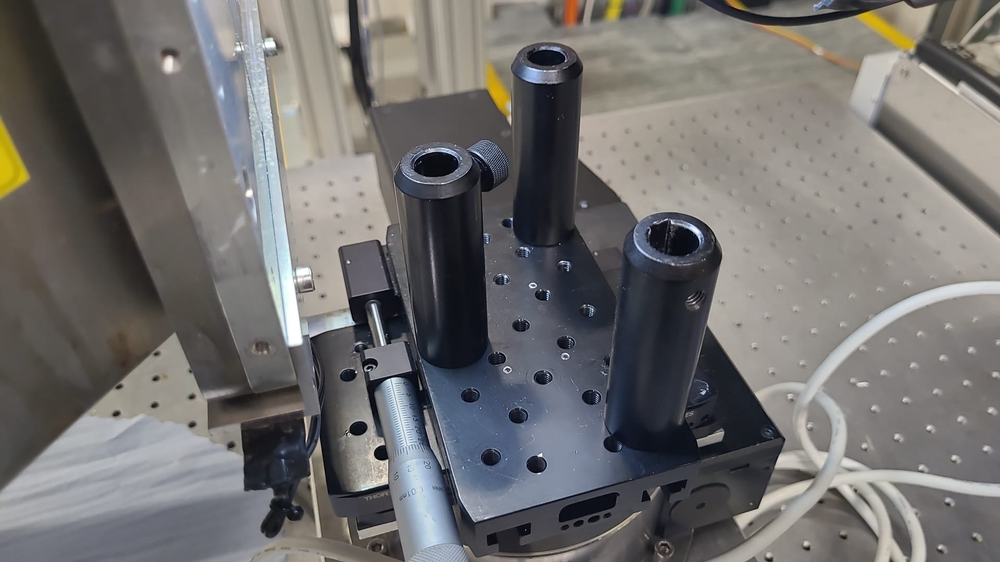

Artefact corr, diffuse bgr subtraction, denoising etc.
=======================================================

.. _Overview:
Overview
------------
Background corrected SAXS frames need to be processed to:
1. extract the ROI of interest (a sector around 3rd meridional order) using pyFAI based cake remapping
2. augment ROI data using chi->chi+180 symmetry
3. subtract the diffuse SAXS signal
4. apply denoising filter if needed
5. correct for streak artefacts if needed

.. _roi:
Extract ROI of interest
-------------------------
Using synthetic SAXS data (pyFAI generated)
1. code showing remapping with images

.. _augment:
Augment using SAXS symmetry
---------------------------
Using above data set
1. code showing augmentation of image with image

.. _synth real data:
Construct synthetic and real SAXS data
---------------------------------------
First get an example SAXS image

.. code-block:: python

  img=frames[0][134] # number 134 from scan i22-729075
  ai = pyFAI.load("testSAXSCal_flipped.poni") # integrator with vertical flipped image

The modified PONI file is:

.. code-block:: python

  # Nota: C-Order, 1 refers to the Y axis, 2 to the X axis 
  # Calibration done at Mon Jan 18 10:55:48 2021
  #poni_version: 2
  #Detector: Pilatus2m
  #Detector_config: {}
  #Distance: 9.7738609
  #Poni1: 0.12554280
  #Poni2: 0.11783720
  #Rot1: 0.00
  #Rot2: 0.00
  #Rot3: 0.00
  #Wavelength: 0.88560148e-10

To display it, 

.. code-block:: python

  jupyter.display(img, label="Inital")

leading to

.. image:: f134_original.png
  :width: 400
  :alt: Alternative text

.. _diffuse bgr corr:
Subtract diffuse bgr
-------------------------
Using synthetic SAXS data (pyFAI generated) with a meridional and diffuse ellipsoidal term
1. Generate synthetic data
2. Display image with and without diffuse term

.. code-block:: python

  ponifile = [i for i in all_files if i.endswith(".poni")][0]
  splinefile = [i for i in all_files if i.endswith(".spline")][0]
  print(ponifile, splinefile)

  #patch the poni-file with the proper path.
  with open(ponifile, "a") as f:
      f.write("SplineFile: %s\n"%splinefile)

  ai = pyFAI.load(ponifile)
  print(ai)

2. Display I(q) profile with and without diffuse term
3. Fit different background terms (cubic spline, exponential background, power law) and test fit quality
4. Repeat with noise added
5. Repeat for different levels of peak height and diffuse bgr, plotting original and final meridional component

.. _denoising:
Apply denoising filter
-------------------------
noisy-to-noisy filter: details to be worked out

.. _streak:
Correct streak artefacts
-------------------------
correct streak artefacts: details to be worked out
