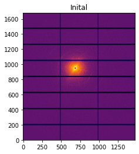

Image treatement
=======================================================

.. _Overview:
Overview
------------
Background corrected SAXS frames need to be processed to:
1. extract the ROI of interest (a sector around 3rd meridional order) using ` pyFAI <https://pyfai.readthedocs.io/en/>`_ based cake remapping
2. augment ROI data using chi->chi+180 symmetry
3. subtract the diffuse SAXS signal
4. apply denoising filter if needed
5. correct for streak artefacts if needed

.. _roi:
Extract ROI of interest
-------------------------
Using synthetic SAXS data (pyFAI generated)
1. code showing remapping with images

.. _augment:
Augment using SAXS symmetry
---------------------------
Using above data set
1. code showing augmentation of image with image

.. _synth real data:
Construct synthetic and real SAXS data
---------------------------------------
First get an example SAXS image

.. code-block:: python

  img=frames[0][134] # number 134 from scan i22-729075
  ai = pyFAI.load("testSAXSCal_flipped.poni") # integrator with vertical flipped image

The modified PONI file is:

.. code-block:: python

  # Nota: C-Order, 1 refers to the Y axis, 2 to the X axis 
  # Calibration done at Mon Jan 18 10:55:48 2021
  #poni_version: 2
  #Detector: Pilatus2m
  #Detector_config: {}
  #Distance: 9.7738609
  #Poni1: 0.12554280
  #Poni2: 0.11783720
  #Rot1: 0.00
  #Rot2: 0.00
  #Rot3: 0.00
  #Wavelength: 0.88560148e-10

To display it, 

.. code-block:: python

  jupyter.display(img, label="Inital")

leading to

Flip image vertically (and create modified PONI file, above, which has y-centre flipped to enable correct calibration)

.. code-block:: python

  img_ud = np.flipud(img)
  ai1 = pyFAI.load("testSAXSCal.poni") #with original x- and y-centrees
  ai2 = pyFAI.load("testSAXSCal_flipped.poni") #with y-centre flipped vertically - cy’ = ny(1679)-cy = 729.90 pixels

Apply 2D integration

.. code-block:: python

  img_ud = np.flipud(img)
  resB = ai.integrate2d_ng(img_ud, 500, 360, unit="q_nm^-1",filename="integratedB.edf")
  resBF = ai.integrate2d_ng(img_ud, 500, 360, unit="q_nm^-1",filename="integratedB.edf")

The first 2D rebinned plot (original data) is correct

The second 2D rebinned plot is clearly incorrect

Use the ai2 integrator (which uses the corrected PONI file):

.. code-block:: python

  res2BF = ai2.integrate2d_ng(img_ud, 500, 360, unit="q_nm^-1",filename="integratedB.edf")

which looks correct

Set up the *model function* by defining the wavevector q (and components), 2\theta and other components:

.. code-block:: python

  y, x = np.mgrid[0:len(img[:,0]), 0:len(img[0])] #could be img_ud as well
  px, py = 172e-6, 172e-6 # in m
  ym, xm = y*py, x*px
  poni1 = 0.12554280 # (y centre) 
  poni2 = 0.11783720 # (x centre)
  xperp = sqrt((xm-poni2)**2+(ym-poni1)**2)
  # define 2theta
  twotheta = np.arctan(xperp/distance)
  # define Ewald sphere radius
  qE = 2*np.pi/wavelen
  # define wavevector q
  q = (4*np.pi/wavelen)*np.sin(twotheta/2.0)
  
  cos(chi), sin(chi) = (xm-poni2)/xperp, (ym-poni1)/xperp
  # to define chi, separate adjustments needed in quadrants II-IV
  chi = np.arctan(sinchi/coschi) #original
  chi = np.where((sinchi<0)&(coschi<0),np.arctan(sinchi/coschi)+np.pi,chi) #quadrant III
  chi = np.where((sinchi>0)&(coschi<0),np.arctan(sinchi/coschi)+np.pi,chi) #quadrant II
  chi = np.where((sinchi<0)&(coschi>0),np.arctan(sinchi/coschi)+2*np.pi,chi) #quadrant IV

  #test the chi display is ok
  jupyter.display(chi, label="chi")

which leads to the following image:

which looks correct. For the qx, qy, qz components:

.. code-block:: python

  # define qx, qy, qz components
  qx=q*np.sqrt(1-(q/(2*qE))**2) * np.cos(chi) #chi in radians
  qy=q*np.sqrt(1-(q/(2*qE))**2) * np.sin(chi)
  qz = np.ones_like(qx)
  qz = (q**2/(2*qE))*qz

.. _meridional model:
Types of meridional models
---------------------------
Let the 3rd order peak position be q0 = 0.27 and the axial width dq0=0.01 (all in nm^-1). The simplest model is an 3D intensity pattern with a Gaussian peak-shape along the radial axis (axial direction) and a conical-type intensity distribution around chi0 with a width dchi0. This can be expressed as:

.. code-block:: python

  # define peak centre and width
  chi0 = np.pi/2.0
  dchi0 = np.pi/6.0
  modelint_sph = np.exp(-0.5*(((q-q0)/dq0)**2))*np.exp(-0.5*(((chi-chi0)/dchi0)**2))
  jupyter.display(modelint, label="sphmodelint")

The second is a 3D intensity pattern with a flat streak-like shape

.. code-block:: python

  # define peak centre and width
  dq1=5*dq0 #lateral peak width vs axial width
  modelint_flat = np.exp(-0.5*(((qy-q0)/dq0)**2))*np.exp(-0.5*((qx**2+qz**2)/dq1**2))

These can be displayed as (spherical):

and (flat)

.. _total_scattering:
Meridional and diffuse scattering
----------------------------------------------
To simulate the diffuse scattering which exists along with the meridional peaks, an ellipsoidal intensity pattern is used.

.. code-block:: python

  amp_m = 1.0
  chi0 = np.pi/2.0
  dchi0 = np.pi/12.0
  meridsph = amp_m*(np.exp(-0.5*(((q-q0)/dq0)**2))*np.exp(-0.5*(((chi-chi0)/dchi0)**2))
  + np.exp(-0.5*(((q-q0)/dq0)**2))*np.exp(-0.5*(((chi-chi0-np.pi)/dchi0)**2)))
  amp_e = 2.0
  ecc = 5.0
  ay = 0.1
  ax = ecc*ax
  saxsellipse = amp_e*np.exp(-(qx/ax)**2-(qy/ay)**2)
  totalsaxs = saxsellipse + meridsph
  jupyter.display(total, label="totalsaxs")

which displays as:

.. math:: \beta \sim \text{Poisson}(\lambda=5)
   :label: beta_prior

The prior on :math:`\beta` is a Poisson distribution with rate parameter of 5 :eq:`beta_prior`.

the mean (:math:`\mu`) of

.. math::

   (a + b)^2 = a^2 + 2ab + b^2

   (a - b)^2 = a^2 - 2ab + b^2

.. _diffuse bgr corr:
Subtract diffuse bgr
-------------------------
Using synthetic SAXS data (pyFAI generated) with a meridional and diffuse ellipsoidal term
1. Generate synthetic data
2. Display image with and without diffuse term

.. code-block:: python

  ponifile = [i for i in all_files if i.endswith(".poni")][0]
  splinefile = [i for i in all_files if i.endswith(".spline")][0]
  print(ponifile, splinefile)

  #patch the poni-file with the proper path.
  with open(ponifile, "a") as f:
      f.write("SplineFile: %s\n"%splinefile)

  ai = pyFAI.load(ponifile)
  print(ai)

.. image:: testerpillar1.jpg
  :width: 400
  :alt: Alternative text

2. Display I(q) profile with and without diffuse term
3. Fit different background terms (cubic spline, exponential background, power law) and test fit quality
4. Repeat with noise added
5. Repeat for different levels of peak height and diffuse bgr, plotting original and final meridional component

.. _denoising:
Apply denoising filter
-------------------------
noisy-to-noisy filter: details to be worked out

.. _streak:
Correct streak artefacts
-------------------------
correct streak artefacts: details to be worked out
