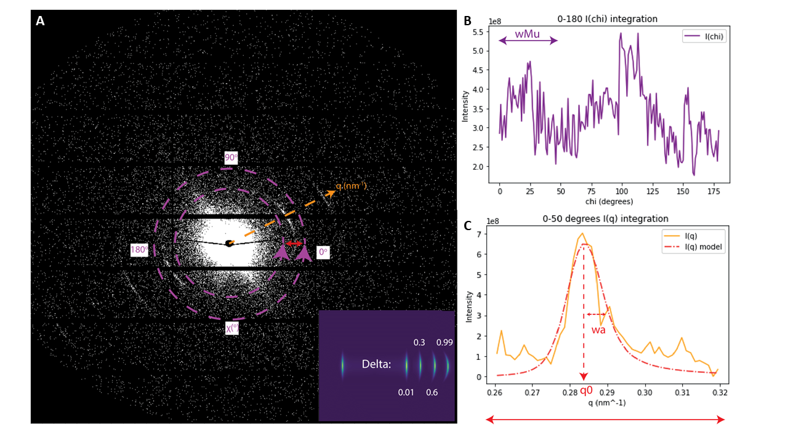
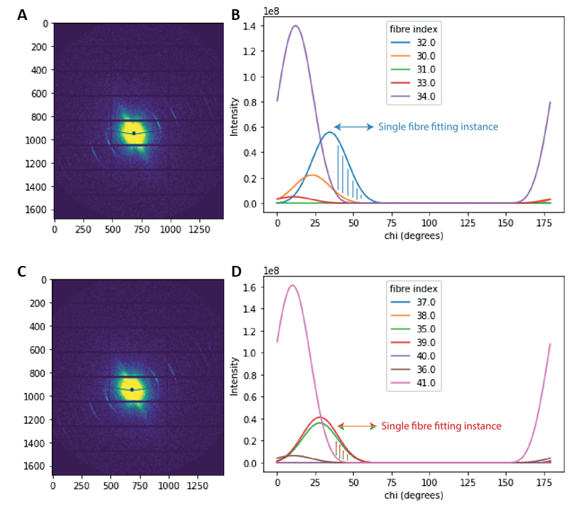
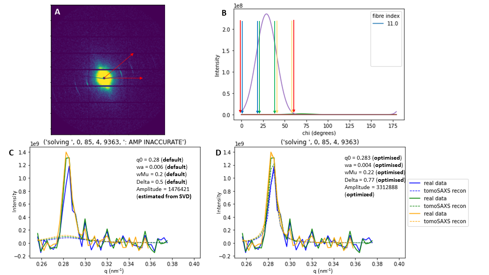
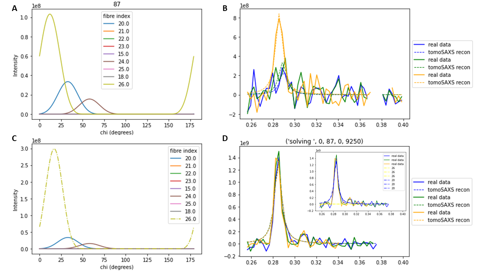
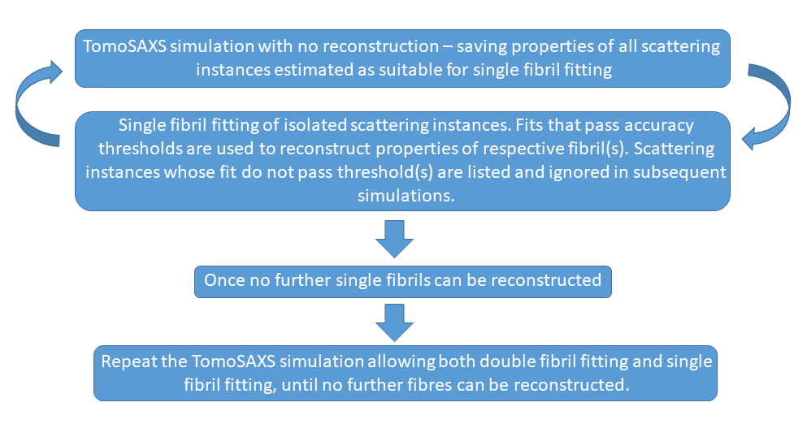

Reconstruction of fibre scattering parameters
==================================

.. _Overview:

Overview
------------
Describes the process for the reconstruction of scattering metrics for individual fibrils in a TomoSAXS slice.

This process uses 3D diffraction modelling to estimate four properties related to nanoscale structure and strain in sampled collagen fibrils:
  
1.	D-period. The mean gauge length of the gap/overlap region of constituent collagen fibrils, measured as the peak position of meridional peaks along the Q axis of SAXS detectors.
  
2.	Wa. The Variation in D-period of constituent collagen fibrils, measured as the width of meridional peaks along the Q axis.
  
3.	WMu. The variation in 3D orientation of constituent collagen fibrils, measured asa the width of meridional peaks along the χ axis.
  
4.	Delta. Related to the width of the fibre, measured as the relative degree of ellipticality of the meridional peak (0 = straight peak; 1 = elliptical peak). 

.. _frame_intro-label:

**FIG. 1. Scattering properties.** (a) SAXS frame with axes of interest highlighted. Orange dashed line running through meridional collagen peak represents the azimuthal q axis  (measured in nm :sup:`-1`); dashed purple lines on either side of peak represent the radial χ axis (measured in degrees :sup:`o`). The relationship between Delta values and peak shape is highlighted by simulations inset on the lower RHS. (b) I(χ) integration between 0-180 :sup:`o`, displaying wMu as the region of χ represented by the scatter of the respective peak. (c) I(q) integration across the peak with q0 highlighted as the peak position of modelled function in q, and wa as the width of the model in q (nm :sup:`-1`).

These properties are measured for scattering instances where a user defined region (∆χ ; default = >10o) of the scattering signal across the χ axis is represented by the independent scattering of either 1(∆χs) or 2 (∆χo) collagen fibres.
These steps are repeated through multiple scans on the same dataset to first solve for all single solvable fibres, and then to include double (2) overlapping fibres in the optimisation process. Future optimisations may solve for single and double fibres concurrently, or using other refinements.

**FIG. 2. Fibre fitting scenarios.** (a) Frame consisting of scattering from five fibrils, whose patterns are estimated along χ in (b). fibre 32 is predicted to provide >90% of scattering intensity for the portion of χ marked with blue vertical lines.
(c) Frame consisting of scattering from seven fibrils, whose patterns are estimated along χ in (d). The combined scattering of fibres 35 and 39 is predicted to provide >90% of scattering intensity for the portion of χ marked with red/green vertical lines.

Independent scattering instances are estimated through the simulation of the respective tomoSAXS scan. Here, the angular orientation values for each indexed fibre (α,β), registered to the voxel coordinates of the tomoSAXS scan (see `registration <https://himadri111-saxs-docs-tutorial.readthedocs.io/en/latest/coreg.html>`_), are used to simulate scattering in each beampath of the TomoSAXS scan. Simulated scattering is integrated across χ, and fibres that produce simulated scattering intensities that provide a percentage of total scatter above a user-defined threshold (rs; default is 90%) are isolated as “solvable”.

Isolated scattering signals are then sampled in the real data for the respective simulated beampath, using 1D azimuthal integration over a user-defined number of angular sectors (“cakes”) (nχc) of user-defined width along χ (∆χc). These samples are then fitted using nonlinear optimisation to the 3D model of diffraction to obtain the fibril parameters (q0, wa, wMu, delta) (see `fibre_model <https://himadri111-saxs-docs-tutorial.readthedocs.io/en/latest/fibremodel.html>`_). The default model for diffraction is set to Nelder-Mead, but can be reset. 

**FIG. 3. Fibril fitting.** (a) SAXS frame with scattering dominated by single fibril. Scattering region of fibril highlighted with red arrows. (b) I(chi) simulation of scattering in frame, with red arrows corresponding to those in (a). (c) Comparison between measured I(q) integration and modelled I(q) using default values for scattering parameters. (d) Comparison between measured I(q) integration and modelled I(q) using optimised values for scattering parameters. 

Fitting produces optimised values for the 4 scattering metrics of the respective fibril. Fitted fibrils are in-turn used to aid deconvolution of neighbouring fibrils (along χ) for all of their scattering instances. This system of fibre fitting deconvolution continues across repeats of the TomoSAXS scan until every possible fibre is reconstructed. E.g. from a tomoSAXS slice with 700 indexed fibrils, 400 should be reconstructed.

**FIG. 4. Fibril fitting.** (a) I(χ) integration of SAXS frame with fibril 26 isolated for single fibril fitting. (b) Comparison between measured I(q) integration and modelled I(q) using optimised values for scattering parameters of fibril 26. (c) I(χ) integration of SAXS frame with reconstructed fibril 26 highlighted with dash-dot, showing that solving of fibril 26 allows fibril 20 to be reconstructed. (d) Comparison between measured I(q) integration and modelled I(q) using optimised values for scattering parameters of fibril 20 and including fibril 26. Differing contributions of fibrils 20 and 26 highlighted in inset plot.

This operation is performed independently for each vertical “slice” in a TomoSAXS scan, the details provided herein are with-respect to a single “slice”.

Prerequisite data:

1.	Spatially registered datasets of per TomoSAXS voxel:

  a.	Alpha values (herein α): vertical orientation angle.

  b.	Beta values (herein β): horizontal orientation angle.

  c.	Fibre indexes.

  d.	Fibre counts: counts of fibre tracing voxels that comprise each indexed fibre.

  e.	Fibre weights: weighting value for the distance between fibre voxels and the SAXS beam centre.

2.	Background-corrected SAXS data for each orientation of the TomoSAXS scan (see LINK TO BGCORR PAGE).

3.	Calibration file for the TomoSAXS scan

4.	Mask file for the TomoSAXS scan

5.	TomoSAXS scan information:
a.	Start/end orientation (in degrees)
b.	Rotation direction (clockwise vs anticlockwise)
c.	Number of angular orientations

6.	“fibrilParam” dictionary comprising entries for each indexed fibre in the respective scan. Each entry contains the index, α, β, estimated amplitude, and !! for each fibre (created during the amplitude estimation process – LINK TO PAGE).

7.	“rotated_beampaths” dictionary, containing dictionaries of indexed fibres for each orientation of the TomoSAXS scan, with corrected β values (change with orientation of beampaths relative to fibres), and added details for the weighting factor and voxel count of each fibre for the beampaths that they encounter for the respective orientation.

8.	“cake_params” dictionary, containing information for subsampling χ and q axes for 1D integrations (created during the amplitude estimation process – LINK TO PAGE).

9.	“initStruct” dictionary, containing initial estimates and estimated maximum variation of for scattering metric values (created during the amplitude estimation process – LINK TO PAGE).

