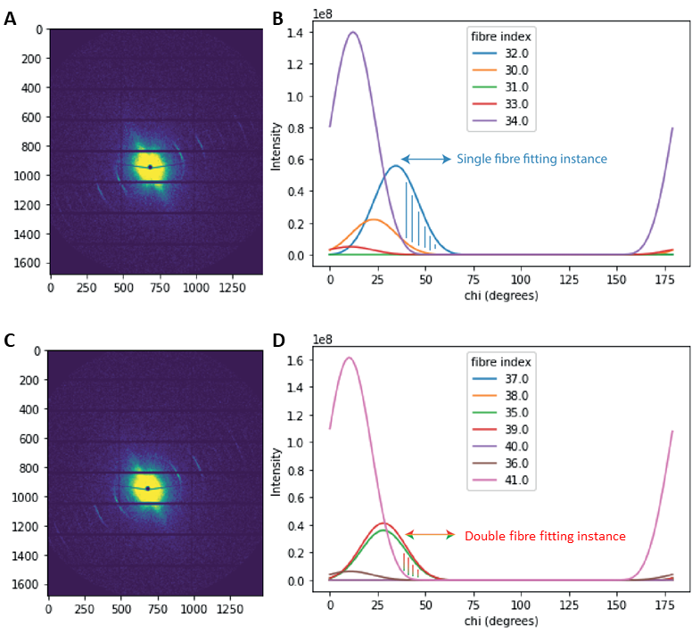

Reconstruction of fibre scattering parameters
==================================

.. _Overview:

Overview
------------
Describes the process for the reconstruction of scattering metrics for individual fibrils in a TomoSAXS slice.

This process uses 3D diffraction modelling to estimate four properties related to nanoscale structure and strain in sampled collagen fibrils:
  
1.	D-period. The mean gauge length of the gap/overlap region of constituent collagen fibrils, measured as the peak position of meridional peaks along the Q axis of SAXS detectors.
  
2.	Wa. The Variation in D-period of constituent collagen fibrils, measured as the width of meridional peaks along the Q axis.
  
3.	WMu. The variation in 3D orientation of constituent collagen fibrils, measured asa the width of meridional peaks along the χ axis.
  
4.	Delta. Related to the width of the fibre, measured as the relative degree of ellipticality of the meridional peak (0 = straight peak; 1 = elliptical peak). 

.. _frame_intro-label:

  
These properties are measured for scattering instances where a user defined region (∆χ ; default = >10o) of the scattering signal across the χ axis is represented by the independent scattering of either 1(∆χs) or 2 (∆χo) collagen fibres.
These steps are repeated through multiple scans on the same dataset to first solve for all single solvable fibres, and then to include double (2) overlapping fibres in the optimisation process. Future optimisations may solve for single and double fibres concurrently, or using other refinements.

FIG. 2. Fibre fitting scenarios. (a) Frame consisting of scattering from five fibrils, whose patterns are estimated along χ in (b). fibre 32 is predicted to provide >90% of scattering intensity for the portion of χ marked with blue vertical lines.
(c) Frame consisting of scattering from seven fibrils, whose patterns are estimated along χ in (d). The combined scattering of fibres 35 and 39 is predicted to provide >90% of scattering intensity for the portion of χ marked with red/green vertical lines.

Independent scattering instances are estimated through the simulation of the respective tomoSAXS scan. Here, the angular orientation values for each indexed fibre (α,β), registered to the voxel coordinates of the tomoSAXS scan (see `registration https://himadri111-saxs-docs-tutorial.readthedocs.io/en/latest/coreg.html`_), are used to simulate scattering in each beampath of the TomoSAXS scan. Simulated scattering is integrated across χ, and fibres that produce simulated scattering intensities that provide a percentage of total scatter above a user-defined threshold (rs; default is 90%) are isolated as “solvable”.
                                                                                                                                                                                                                                    
Isolated scattering signals are then sampled in the real data for the respective simulated beampath, using 1D azimuthal integration over a user-defined number of angular sectors (“cakes”) (nχc) of user-defined width along χ (∆χc). These samples are then fitted using nonlinear optimisation to the 3D model of diffraction to obtain the fibril parameters (q0, wa, wMu, delta) (see `fibre_model <https://himadri111-saxs-docs-tutorial.readthedocs.io/en/latest/fibremodel.html>`_). The default model for diffraction is set to Nelder-Mead, but can be reset. 
                                                                                                                                                                                                                                    
                                                                                                                                                                                                                                    
