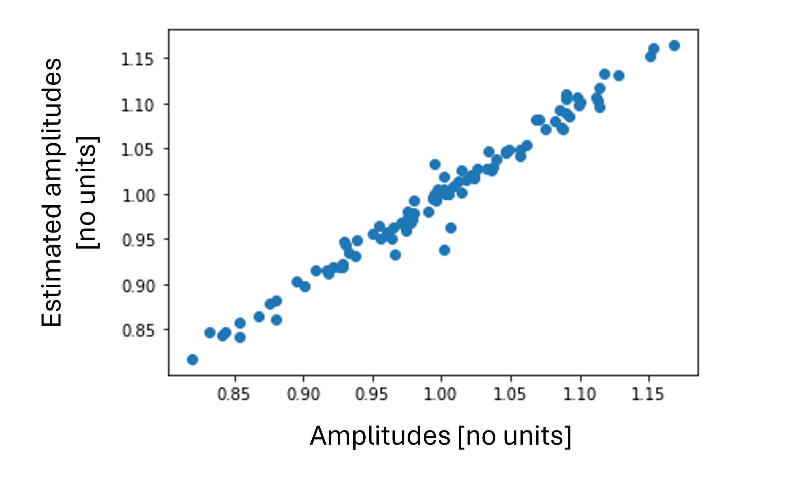
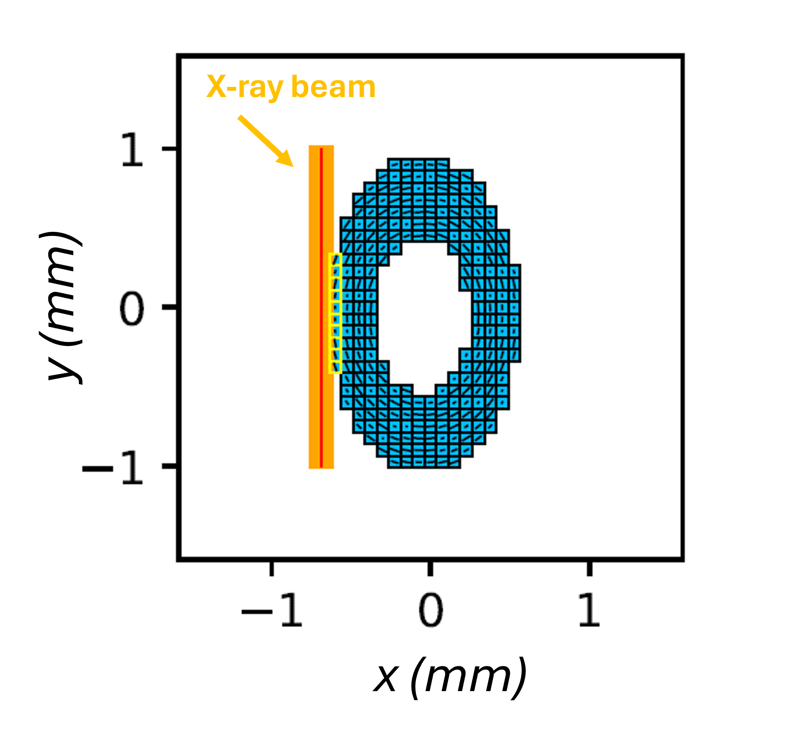
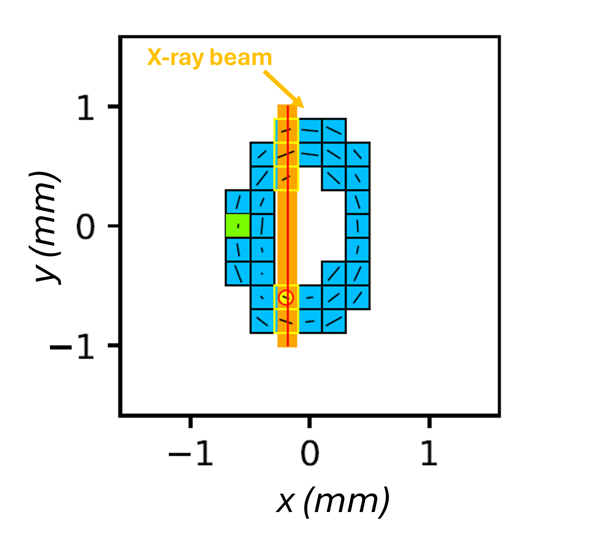
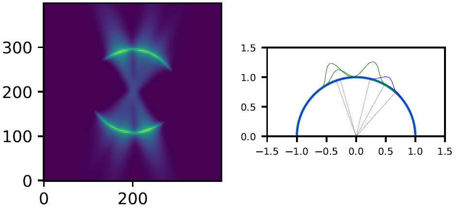
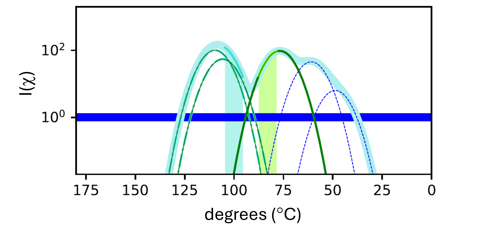

.. role:: python(code)
  :language: python
  :class: highlight

SAXS-Recon
============

.. _Overview:

Overview
------------
Details of the reconstruction process, giving examples of single-, double- and higher-overlap cases.

.. _initial:

Initialisation
---------------
The fibre/voxel index is :math:`i` and the scan index is :math:`k`. Since the amplitudes of the fibres in each voxel :math:`a_{i}` is not known, the following estimation procedure is used. Approximate the fibres as having the mean fibril-parameter values of :math:`q_{i,0},w_{i,a},w_{i,\mu}` (which will be estimated from :math:`I^{k}(q)` for all scan points k). 

Calculate :math:`I^{k}_{r}(\chi)` for all scan points k and all rotation angles :math:`r` (with diffuse scattering subtracted as in the :: previous section ::. Define the observable scattering from each voxel as :math:`w_{i,r}^{k} \times V_{i}(q,\chi;{\bf{f}};(\alpha,\beta);r)` where :math:`\bf{f}` is a shorthand for "fibril characteristics" :math:`q_{i,0},w_{i,a},w_{i,\mu}`, and :math:`w_{i,r}^{k}` is a weighting factor which is proportional to the intersection of the X-ray microfocus beam with the voxel :math:`i` at a rotation :math:`r`. Since the X-ray beam is a pencil beam, each scattering path will contain only a small subset of voxels; i.e. most of the :math:`w_{i,r}^{k}` will be zero (across :math:`i`) for each :math:`k`. We denote :math:`\bf{\alpha}\equiv(\alpha,\beta).`

Then we can equate 

.. math::
   :nowrap:

   \begin{eqnarray}
      I^{k1}_{r1}(\chi)    & = & w_{1,r1}^{k1} \times a_{1} V_{1}(\chi;{\bf{f_{1},\alpha_{1}}};r1) + \ldots + w_{M,r1}^{k1} \times a_{M} V_{M}(\chi;{\bf{f_{M},\alpha_{M}}};r1)\\
      I^{k2}_{r1}(\chi)    & = & w_{1,r1}^{k2} \times a_{1} V_{1}(\chi;{\bf{f_{1},\alpha_{1}}};r1) + \ldots + w_{M,r1}^{k2} \times a_{M} V_{M}(\chi;{\bf{f_{M},\alpha_{M}}};r1)\\
      I^{k3}_{r1}(\chi)    & = & \ldots \\
      I^{kP}_{rN}(\chi)    & = & w_{1,rN}^{kP} \times a_{1} V_{1}(\chi;{\bf{f_{1},\alpha_{1}}};rN) + \ldots + w_{M,rN}^{kP} \times a_{M} V_{M}(\chi;{\bf{f_{M},\alpha_{M}}};rN)
   \end{eqnarray}

where :math:`k1,\ldots,kP` represents the scan points, :math:`r1,\ldots,rN` the number of rotations and :math:`1,\ldots,M` the number of voxels in the sample volume. 

Since the mean fibril characteristics are known (:math:`\bf{f}`) the above set of equations can be evaluated at multiple angular (:math:`\chi`) points from 0 to :math:`\pi`, leading to a set of linear equations in :math:`a_{i}`. As the number of angular points can in principle be arbitrarily increased (:math:`Q_{\chi}`) we can adjust the parameters such that :math:`N \times Q_{\chi} > M`, leading to an overdetermined system of linear equations. These can be solved using the numpy library :python:`np.linalg.lstsq` 

.. code-block:: python
   :linenos:

   import numpy as np
   """
   the equation works like
   1                2       3   ....   Nfibrils = I(chi1)
   a1*model(chi1) + a2*model(chi1) ... aN*model(chi1) = I(chi1)
   a1*model(chi2) + a2*model(chi2) ... aN*model(chi2) = I(chi2)
   .
   .
   .
   M = Nx*r*n_chi_svd
   a(M)*model(chiM) + a2*model(chiM) ... aN*model(chiM) = I(chiM)
   """
   """
   for chi_s_svd points (j: 0 to n_chi_svd-1)
   for each voxel in pdict, evaluate I(chi) and model weight at chi_s_svd points
   use mean values of q0, wa, wMu
   if the value is > threshold (e.g. 1% of max val) then 
   in matrix A, add model weight to "indx" column; "nxscan*n_chi_svd + j" row
   add it to the Ichi value at that point chi_s_svd; add to b_svd
   """
   ampval2=np.linalg.lstsq(a_svd_arr, b_svd_arr, rcond=None)[0]

.. _validationinitial:

Validation of initialisation
--------------------------------
In the plot below, we show the estimated amplitudes from a 10x10 planar slice

.. _geometry:

Simulated tissue geometry
--------------------------------
Consider a toy "IVD-like" structure, as a discretized elliptical shell. Fibrils are shown (in x-z plane projection viewed from above) on a per-voxel basis:

As can be seen, the fibrils curve around the central nucleus pulposus structure. Their pitch :math:`\alpha_{i}` is intended to change as a function of distance from centre (this needs work) and the angular rotation :math:`\beta_{i}` (the polar angle equivalent) will change as one goes around the central nucleus pulposus.

Simulating the tomoSAXS SAXS scans
-----------------------------------------------
Using estimated amplitudes, initial guess for fibril characteristics, and fixed :math:`(\alpha_{i},\beta_{i})` per voxel, the 2D- and 1D- SAXS pattern can be simulated for each scan-point and rotation angle, using the model scattering functions described in the earlier section :ref:`section_fibre_diff`. 

.. _summaryalgorithm:

The flowchart of steps is:

#. Repeatedly loop over all rotation angles and scan points (i.e. iterate through all SAXS frames), and carry out the steps below, until no additional voxels are solved after a full set of 
  * For each SAXS pattern, simulate the beam path through  the defined sample geometry in SAXSCOREG, and identify the intersecting voxels (weighted according to how much of the beam photons pass through that voxel). This is denoted as the variable :python:`voxelsPerPath`, which is a list of dictionaries. Each list element corresponds to a beam path. Each beam path is associated with a dictionary of all voxels intersected by that beam, along with auxiliary/metadata. 
  * Calculate :math:`I(\chi)` for each scan point, which is a sum of all component voxel contributions (with estimated parameters)
#. For each voxel in the beam path
  * Check if the voxel can be classified as single-voxel as per :ref:`singlevoxel`. Take into account existing voxels which have been solved (i.e. subtracts their contribution). If yes, solve it
  * Check all neighbours of the voxel to see if the voxel+neighbour pair can be classified as separable overlap-voxel pair as per :ref:`overlapvoxel`. If yes, solve it
  * Update the master list of all voxels, changing unsolved voxels to solved

Results will be shown below. This process is linear and proceeds from the first to last scan. Improvements in the method could include:

#. Rank order the contributions of different voxels to the scattering pattern. Solve the strongest contributing voxels first, then move down to less intense contributors. This may reduce propagation errors due to uncertainty of fit of noisy data.
#. Overlapping voxel contributions are an issue at large scan sizes. Find ways to fit triplets and higher order overlaps, going beyond single- and double-voxels

For clarity, we show this for a small 10 x 10 grid below. The Figure below shows the beam path after a few iterations (in which some voxels have been solved). The convention is to represent :math:`I(\chi)` componentss from unsolved voxel in blue, and from solved voxels in green. At any given point in the reconstruction there will be a mixture of blue and green curves, starting all blue and with green number increasing as the reconstruction progresses.  

  ..

  Blue: unsolved voxels; green: already solved voxel; yellow circle: solved in current SAXS pattern. Orange rectangle: beampath with red center line

The 2D pattern for this path is shown below, along with a visually clearer polar representation. Note that in real data, the 2D pattern will be the experimental one. 

  ..

  Left: 2D SAXS pattern of simulated 3rd order meridional peak; right: Polar plot representation of the :math:`I(\chi)` components. Blue/green denote unsolved/solved

For the above case we can see there are some known contributions from already solved voxels (two green curves, between :math:`100^{\degree}` and :math:`125^{\degree}`), one voxel which is solved in the current iteration, and two unknown voxels (blue, between :math:`100^{\degree}` and :math:`125^{\degree}`). The second blue one is not clear in the polar plot as it is much smaller than all the others. 

Therefore, the total :math:`I(\chi)` pattern can be represented as the sum of the component terms in a conventional rectangular Cartesian plot as below, using a log-scale for the y-axis to help identify voxels with a weak scattering contribution at this combination of rotation angles and scan step. 

  ..

  Left: 2D SAXS pattern of simulated 3rd order meridional peak; right: Polar plot representation of the :math:`I(\chi)` components. Blue/green denote unsolved/solved

.. _singlevoxel:

Identifying voxel-specific diffracting sectors
-----------------------------------------------
Each fibre :math:`i` contributes significantly (above a noise threshold) only at specific rotation angles :math:`i` and angular sectors :math:`\delta \chi_q`. To calculate this, using the estimated :math:`\{a_{i},\bf{f}_{i},,\bf{\alpha}_{i}\}_{M}` parameters, the total measured angular SAXS intensity :math:`I^{k}_{r}(\chi)` for each rotation angle :math:`r_{j}`, and the individual components :math:`w_{i,r}^{k} \times a_{i} V_{i}(\chi;{\bf{f_{i},\alpha_{i}}};r)` are calculated. 

SHOW EXAMPLE PLOT

As can be seen, some fibres are the predominant contributors to the SAXS signal in certain angular sectors :math:`\delta \chi_q` (shown as shaded), while other fibres are overlapping. For the first category, the fibre characteristics can be extracted by fitting the radial intensity profiles along these angular sectors to the model scattering functions. The angular sector where the fibre :math:`i` is the predominant contributor is estimated by taking the ratio of the simulated :math:`w_{i,r}^{k} \times a_{i} V_{i}(\chi;{\bf{f_{i},\alpha_{i}}};r)` to :math:`I^{k}_{r}(\chi)` over the full :math:`\chi` range, and finding if there exists any :math:`\delta \chi_q` where the ratio is :math:`>t_{s}` where :math:`t_{s}` is a single-voxel dimensionless ratio e.g. :math:`\rho_{sv}> 0.95` (i.e. the fibre :math:`i` contributes at least :math:`t_{s}` of the intensity over :math:`\delta \chi_q^{sv}`. This step is called Single-Voxel Estimation, and an example of the :math:`I(q)` fits is shown below. 

SHOW EXAMPLE PLOT

.. _overlapvoxel:

Next we consider the case where two fibres have overlapping patterns and their combined intensity is the dominant contribution over the angular sector :math:`\delta \chi_q^{2v}` ('2' for 2 overlapping fibres) for a specific rotation angle. By a combined fit of the 2 component functions to the measured :math:`I(q;\chi)` profile over the overlapping sector, both fibril-parameters can be evaluated. This step is called Double-Voxel Estimation and an example of the :math:`I(q)` fits is shown below.

SHOW EXAMPLE PLOT
 
.. _algorithm:

Iterative solution of voxels
-----------------------------------------------

To solve the fibril-parameters for the voxels, the above steps for :ref:`voxel-solution <voxelsol>` are combined with :ref:`estimation <angular>` of :math:`I^{k}_{r}(\chi)` for each scan-point and rotation angle. As individual voxels get fitted, they are moved to a "solved" list whose parameters are known. Therefore, when :ref:`estimating voxels <voxelsol>`, only unsolved voxels are included when simulating the angular SAXS intensity profile and identifying any single or overlapping voxels. 

The plot below shows how the percentage of solved voxels increases with each rotation angle and iteration. In the simplest implementation, solution proceeds serially without ranking or prioritising the peak intensity contributions from specific voxels. 

By prioritising the highest single-voxels or double-scattering pairs for initial solution, possible benefits could include more accurate estimate of these initial voxels which then reduce the propagated error for subsequent voxels which have to subtract out these known contributors before fitting.

Test video created from Powerpoint and uploaded to Youtube channel, to check the link from Youtube channel to ReadTheDocs works.

.. raw:: html

    

        <iframe src="https://www.youtube.com/embed/zj4rlZujZsk?si=7O6vDjid2SV6LrGH" frameborder="0" allowfullscreen style="position: absolute; top: 0; left: 0; width: 75%; height: 75%;"></iframe>
    

