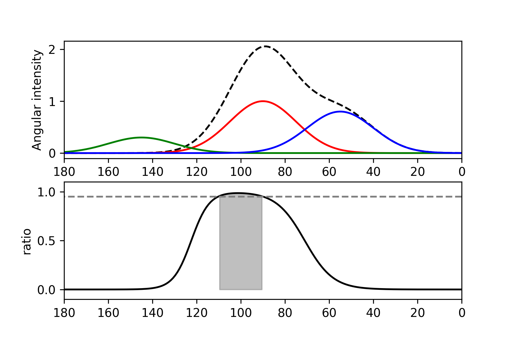
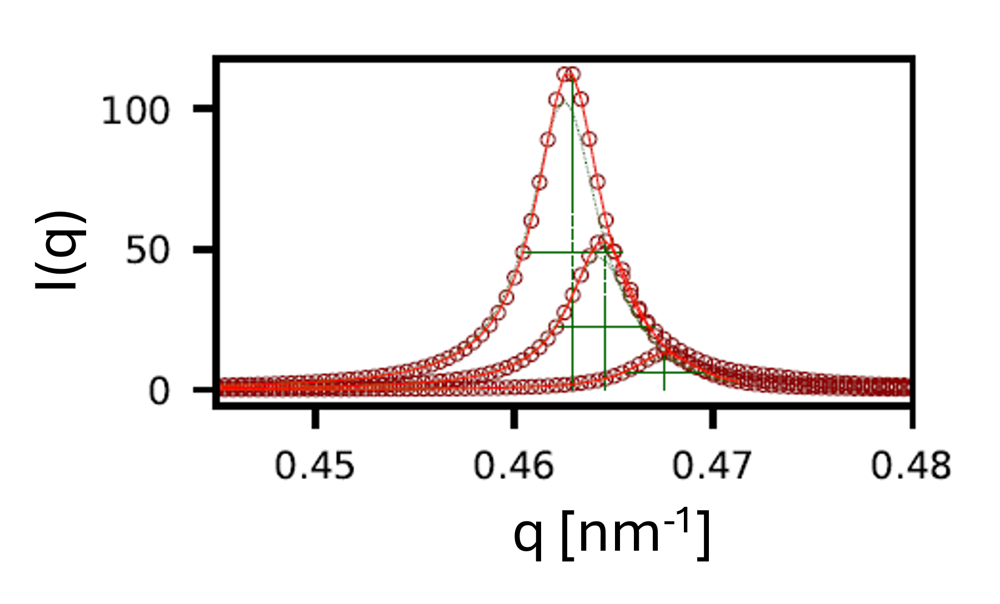
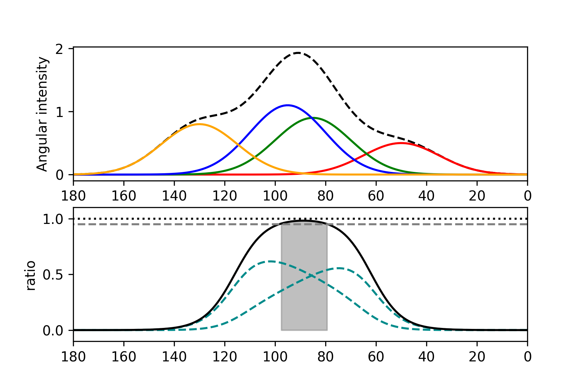
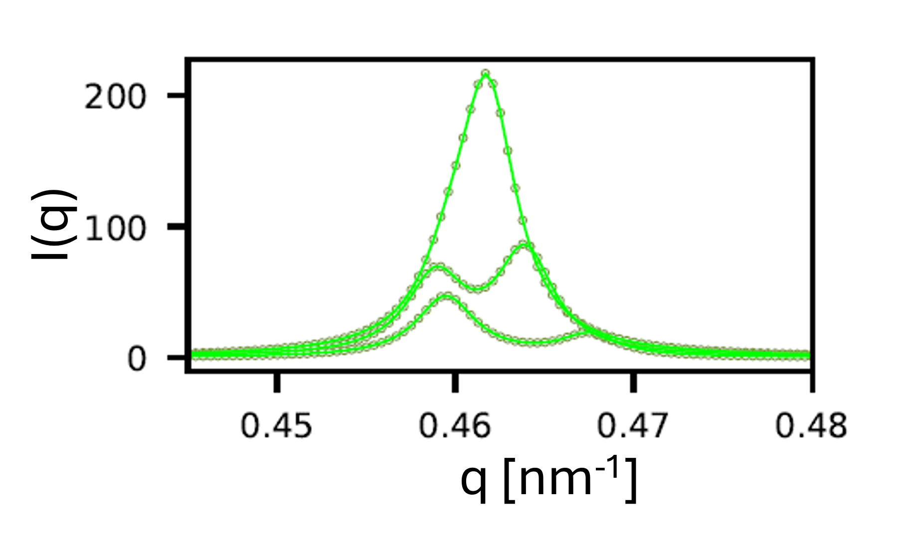
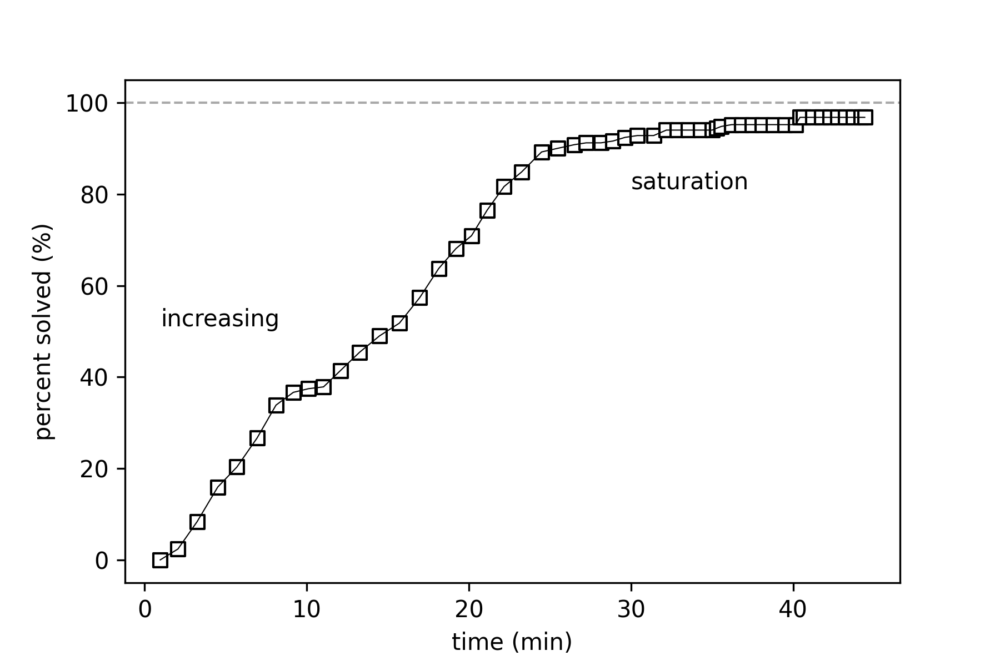

.. role:: python(code)
  :language: python
  :class: highlight

SAXS-Recon
============

.. _Overview:

Overview
------------
Details of the reconstruction process, giving examples of single-, double- and higher-overlap cases.

.. _initial:

Initialisation
---------------
The fibre/voxel index is :math:`i` and the scan index is :math:`k`. Since the amplitudes of the fibres in each voxel :math:`a_{i}` is not known, the following estimation procedure is used. Approximate the fibres as having the mean fibril-parameter values of :math:`q_{i,0},w_{i,a},w_{i,\mu}` (which will be estimated from :math:`I^{k}(q)` for all scan points k). 

Calculate :math:`I^{k}_{r}(\chi)` for all scan points k and all rotation angles :math:`r` (with diffuse scattering subtracted as in the :: previous section ::. Define the observable scattering from each voxel as :math:`w_{i,r}^{k} \times V_{i}(q,\chi;{\bf{f}};(\alpha,\beta);r)` where :math:`\bf{f}` is a shorthand for "fibril characteristics" :math:`q_{i,0},w_{i,a},w_{i,\mu}`, and :math:`w_{i,r}^{k}` is a weighting factor which is proportional to the intersection of the X-ray microfocus beam with the voxel :math:`i` at a rotation :math:`r`. Since the X-ray beam is a pencil beam, each scattering path will contain only a small subset of voxels; i.e. most of the :math:`w_{i,r}^{k}` will be zero (across :math:`i`) for each :math:`k`. We denote :math:`\bf{\alpha}\equiv(\alpha,\beta).`

Then we can equate 

.. math::
   :nowrap:

   \begin{eqnarray}
      I^{k1}_{r1}(\chi)    & = & w_{1,r1}^{k1} \times a_{1} V_{1}(\chi;{\bf{f_{1},\alpha_{1}}};r1) + \ldots + w_{M,r1}^{k1} \times a_{M} V_{M}(\chi;{\bf{f_{M},\alpha_{M}}};r1)\\
      I^{k2}_{r1}(\chi)    & = & w_{1,r1}^{k2} \times a_{1} V_{1}(\chi;{\bf{f_{1},\alpha_{1}}};r1) + \ldots + w_{M,r1}^{k2} \times a_{M} V_{M}(\chi;{\bf{f_{M},\alpha_{M}}};r1)\\
      I^{k3}_{r1}(\chi)    & = & \ldots \\
      I^{kP}_{rN}(\chi)    & = & w_{1,rN}^{kP} \times a_{1} V_{1}(\chi;{\bf{f_{1},\alpha_{1}}};rN) + \ldots + w_{M,rN}^{kP} \times a_{M} V_{M}(\chi;{\bf{f_{M},\alpha_{M}}};rN)
   \end{eqnarray}

where :math:`k1,\ldots,kP` represents the scan points, :math:`r1,\ldots,rN` the number of rotations and :math:`1,\ldots,M` the number of voxels in the sample volume. 

Since the mean fibril characteristics are known (:math:`\bf{f}`) the above set of equations can be evaluated at multiple angular (:math:`\chi`) points from 0 to :math:`\pi`, leading to a set of linear equations in :math:`a_{i}`. As the number of angular points can in principle be arbitrarily increased (:math:`Q_{\chi}`) we can adjust the parameters such that :math:`N \times Q_{\chi} > M`, leading to an overdetermined system of linear equations. These can be solved using the numpy library :python:`np.linalg.lstsq` 

.. code-block:: python
   :linenos:

   import numpy as np
   """
   the equation works like
   1                2       3   ....   Nfibrils = I(chi1)
   a1*model(chi1) + a2*model(chi1) ... aN*model(chi1) = I(chi1)
   a1*model(chi2) + a2*model(chi2) ... aN*model(chi2) = I(chi2)
   .
   .
   .
   M = Nx*r*n_chi_svd
   a(M)*model(chiM) + a2*model(chiM) ... aN*model(chiM) = I(chiM)
   """
   """
   for chi_s_svd points (j: 0 to n_chi_svd-1)
   for each voxel in pdict, evaluate I(chi) and model weight at chi_s_svd points
   use mean values of q0, wa, wMu
   if the value is > threshold (e.g. 1% of max val) then 
   in matrix A, add model weight to "indx" column; "nxscan*n_chi_svd + j" row
   add it to the Ichi value at that point chi_s_svd; add to b_svd
   """
   ampval2=np.linalg.lstsq(a_svd_arr, b_svd_arr, rcond=None)[0]

.. _validationinitial:

Validation of initialisation
--------------------------------
In the plot below, we show the estimated amplitudes from a 10x10 planar slice

.. image:: pred_vs_actualAmps_labels.png
  :width: 400

.. _geometry:

Tissue geometry representation
--------------------------------
The CT image is discretized into cubic SAXS-voxels of size :math:`(beamsize)^{3}`. The beamsize is typically :math:`\sim 20 \mu m` at beamline I22, DLS. To visualise the geometry of the sample, consider a toy "IVD-like" structure, as a discretized elliptical shell. Fibrils are shown (in x-z plane projection viewed from above) on a per-voxel basis:

.. _modelivdtop:

  Sample geometry (IVD-like shape)

  Squares represent SAXS voxels viewed from above. Lines in square: fibril with 3D orientation projected in 2D (small length means more closely pointing out of paper or screen, long length means more closely in paper or screen plane)

As can be seen, the fibrils curve around the central nucleus pulposus structure. Their pitch :math:`\alpha_{i}` is intended to change as a function of distance from centre (this needs work) and the angular rotation :math:`\beta_{i}` (the polar angle equivalent) will change as one goes around the central nucleus pulposus.

Rotation
^^^^^^^^^^^
When the sample is rotated around the vertical axis by :math:`r`, the voxels will rotate as well. Ignore the few green voxels for now, it will bee explained in :ref:`workedexampleref`.

Reconstruction principle
-----------------------------------------------
Using estimated amplitudes, initial guess for fibril characteristics, and fixed :math:`(\alpha_{i},\beta_{i})` per voxel, the 2D- and 1D- SAXS pattern can be simulated for each scan-point and rotation angle, using the model scattering functions described in the earlier section :ref:`section_fibre_diff`. 

Flowchart
^^^^^^^^^^^
The flowchart of steps is:

#. Repeatedly loop over all rotation angles and scan points (i.e. iterate through all SAXS frames), and carry out the steps below, until no additional voxels are solved after a full set of 
  * For each SAXS pattern, simulate the beam path through  the defined sample geometry in SAXSCOREG, and identify the intersecting voxels (weighted according to how much of the beam photons pass through that voxel). This is denoted as the variable :python:`voxelsPerPath`, which is a list of dictionaries. Each list element corresponds to a beam path. Each beam path is associated with a dictionary of all voxels intersected by that beam, along with auxiliary/metadata. 
  * Calculate :math:`I(\chi)` for each scan point, which is a sum of all component voxel contributions (with estimated parameters)
#. For each voxel in the beam path
  * Check if the voxel can be classified as single-voxel as per :ref:`singlevoxel`. Take into account existing voxels which have been solved (i.e. subtracts their contribution). If yes, solve it
  * Check all neighbours of the voxel to see if the voxel+neighbour pair can be classified as separable overlap-voxel pair as per :ref:`overlapvoxel`. If yes, solve it
  * Update the master list of all voxels, changing unsolved voxels to solved

Results will be shown below. This process is linear and proceeds from the first to last scan. 

Future method improvements
^^^^^^^^^^^^^^^^^^^^^^^^^^^^^^^^
Improvements in the method could include:

#. Rank order the contributions of different voxels to the scattering pattern. Solve the strongest contributing voxels first, then move down to less intense contributors. This may reduce propagation errors due to uncertainty of fit of noisy data.
#. Overlapping voxel contributions are an issue at large scan sizes. Find ways to fit triplets and higher order overlaps, going beyond single- and double-voxels

.. _workedexampleref:
A worked example
-----------------------------------------------

For clarity, we show this for a small 10 x 10 grid below. 

For the first step (simulated structure only), when the program is run, a pop window appears which asks for the planar size of the sample and also confirms that only a single plane is being analyzed

The Figure below shows the beam path after a few iterations (in which some voxels have been solved). The convention is to represent :math:`I(\chi)` components from unsolved voxels in blue, and from solved voxels in green. At any given point in the reconstruction there will be a mixture of blue and green curves, starting all blue and with green number increasing as the reconstruction progresses.  

.. _beampathsmall:
.. figure:: figures-saxsrecon/190124_small_IVD_top.png
  :width: 400

  Beam path (small sample)

  Blue: unsolved voxels; green: already solved voxel; yellow circle: solved in current SAXS pattern. Orange rectangle: beampath with red center line

2D and polar view
^^^^^^^^^^^^^^^^^^^^^
The 2D pattern for this path is shown below, along with a visually clearer polar representation. Note that in real data, the 2D pattern will be the experimental one. 

.. _2dpolar:
.. figure:: figures-saxsrecon/190124_2DSAXS_PolarPlot.png
  :width: 700

  ..

  Left: 2D SAXS pattern of simulated 3rd order meridional peak; right: Polar plot representation of the :math:`I(\chi)` components. Blue/green denote unsolved/solved

Total :math:`I(\chi)` from components
^^^^^^^^^^^^^^^^^^^^^^^^^^^^^^^^^^^^^^^^^^^^
For the above case we can see there are some known contributions from already solved voxels (two green curves, between :math:`100^{\circ}` and :math:`125^{\circ}`), one voxel which is solved in the current iteration, and two unknown voxels (blue, between :math:`25^{\circ}` and :math:`75^{\circ}`). The second blue one (toward :math:`25^{\circ}`) is not clear in the polar plot as it is much smaller than all the others. 

Therefore, the total :math:`I(\chi)` pattern can be represented as the sum of the component terms in a conventional rectangular Cartesian plot as below, using a log-scale for the y-axis to help identify voxels with a weak scattering contribution at this combination of rotation angles and scan step. 

.. _logichi:
.. figure:: figures-saxsrecon/190124_logIchi.png
  :width: 700

  Log-scaled :math:`I(\chi)` curve 

  Thick light blue line: total :math:`I(\chi)` scattering from the beam path in Figure :ref:`beampathsmall`. Component curves: model predictions from each voxel in path (blue: unsolved; thick green: solved (single voxel); green: solved (overlap), as described in :ref:`singlevoxel` and :ref:`overlapvoxel` below.

.. _singlevoxel:
Identifying single-voxel diffracting sectors
^^^^^^^^^^^^^^^^^^^^^^^^^^^^^^^^^^^^^^^^^^^^^^^^^^^^^^

Each fibre :math:`i` contributes significantly (above a noise threshold) only at specific rotation angles :math:`i` and angular sectors :math:`\delta \chi_q`. To calculate this, using the estimated :math:`\{a_{i},\bf{f}_{i},,\bf{\alpha}_{i}\}_{M}` parameters, the total measured angular SAXS intensity :math:`I^{k}_{r}(\chi)` for each rotation angle :math:`r_{j}`, and the individual components :math:`w_{i,r}^{k} \times a_{i} V_{i}(\chi;{\bf{f_{i},\alpha_{i}}};r)` are calculated. 

A simple example is shown below, where we have 3 fibres contributing different components. The total intensity :math:`I(\chi)`, as well as the individual intensities :math:`I^{k}_{r}(\chi)`, are plotted below. We wish to identify an angular :math:`\chi` sector where fibre 1 is the principal contributor to the SAXS signal, and where fitting the SAXS signal to a single-fibril model function (of the type defined in the earlier section :ref:`section_fibre_diff`) is a good approximation. 

For this purpose, define a threshold close to 1, e.g. :math:`\lambda_{sv}=0.95`, and find if an angular sector :math:`\chi` sector exists where :math:`r_{sv}=I_{1}(\chi)/(I_{1}(\chi)+I_{2}(\chi)+I_{3}(\chi))>\lambda_{sv}` will satisfy this requirement, as shown in the Figure :ref:`svprinciple-label` below.  

.. _svprinciple-label:

  SV principle

  Top: Three different fibres (1: red, 2: blue, 3: green) contributing to :math:`I(\chi)` in different angular sectors Bottom: ratio of fibre 1 intensity to total intensity as a function of :math:`\chi`. Horizontal line is at :math:`\lambda_{sv}=0.95`. Shaded region is the :math:`\chi`-sector where :math:`I_{1}(\chi)>\lambda_{sv}`

This method is applied to the :math:`I(\chi)` profiles in Figure :ref:`svprinciple-label` to obtain the gray-shaded angular sector. 

Fitting single-voxel diffracting sectors
^^^^^^^^^^^^^^^^^^^^^^^^^^^^^^^^^^^^^^^^^^^^^^^^^^^^^^

Using this principle on SAXS data of the type shown in Figure :ref:`logichi`, we identify, for each voxel in the path, angular sectors where their contribution predominates in the sense described in :ref:`singlevoxel`. If this ratio exceeds :math:`\lambda_{sv}` over an angular sector equal to or greater than :math:`\chi_{ref}^{win}= 10^{\circ}` (denoted :python:`chiRefWindow`), the voxel is considered solvable independent of other voxels. 

This test is carried out in the function :python:`findChiWindow` within the :python:`analyseForSV` function. The parameters :python:`threshold_interference` and :python:`threshold_detection` denote respectively :math:`100(1-\lambda_{sv})` and the minimum absolute intensity level that the currently analysed voxel must have. By checking the second parameter, we avoid the condition where an extremely weak peak is being fitted at the tails of the total scattering. In practice, we expect this will be less of an issue for real data, where the presence of noise means that extremely weak voxels will not satisfy the :math:`r_{sv}>\lambda_{sv}` condition.

.. code-block:: python

  chiwindow, solvable = findChiWindow(ichi,Ichi_us,chirange,chiwin=chiRefWin,threshold_interference=thresh_int_SV,threshold_detection=thresh_det_SV)

if :python:`solvable` is :python:`True` then the voxel is marked as solvable. 

For these voxels, we find the angular sector of width :python:`chiRefWindow` where the ratio :math:`r_{sv}` is maximum, and over this angular sector, radial profiles are calculated at three angles (left, center and right) from the measured data. These radial profiles are fit to the model predictions for that specific voxel.  

.. _svfit-label:

  SV fits

  Fits of the fibre diffraction model to angular slices :math:`I(q)` across the :python:`chiRefWindow`. Symbols denote real (simulated) data and lines denote fits.

It can be seen that a good fit is obtained in Figure :ref:`svfit-label`. A close examination of the right-hand side will show a slight underestimation by the fit. The reason behind this is "leakage" of intensity from the near-flat streaks from angularly-adjacent voxels (shown in Section :ref:`section_fibre_diff`) toward the right-hand tail end of the peak of the voxel being fitted. To mitigate against this, the fit is restricted to the full left hand side of the peak and only part of the right hand side.

In the code, the function which carries out the analysis for single-voxel condition, and fits it, is called :python:`analyseForSV`. This function is called for each voxel along the beam path shown in Figure :ref:`beampathsmall`. While the list of arguments is long, the parameters after :python:`chiIntPars` are mainly display and fit-setting parameters. 

.. code-block:: python

  def analyseForSV(FibrilPars,rotFibrilPars,vox,indxVox,voxelsInPath,alphaVox,betaVox,
                   weightVox,chirange,Ichi_us,chiRefWin,rotAngle,chiIntPars,qIntPars,
                   dx_pack,n_slices,dchi_slices,filename,thresh_SV,fig,axes,
                   plotFig=True,data=None,SVSuccess=False,color_solved="green",
                   color_unsolved="blue",color_filled="chartreuse",linestyle_solved="solid",
                   linestyle_unsolved="solid",linewidth_solved=1.5,linewidth_unsolved=0.5)

.. _overlapvoxel:
Identifying double-voxel overlapping sectors
^^^^^^^^^^^^^^^^^^^^^^^^^^^^^^^^^^^^^^^^^^^^^^^^^^^^^^

Next we consider the case where two fibres have overlapping patterns and their combined intensity is the dominant contribution over a specified angular sector. The Figure :ref:`ovprinciple-label` shows an example case with 4 fibres, where fibres 2 and 3 are overlapping. In this case, neither fibre 2 nor 3 are solvable by themselves, as seen by their ratios, but their combined ratio is :math:`>\lambda_{ov}` where :math:`>\lambda_{ov} = 0.95`. 

.. _ovprinciple-label:

  OV principle

  Top: Four different fibres (1: red, 2: blue, 3: green, 4: orange) contributing to :math:`I(\chi)` in different angular sectors. Bottom: ratios of fibre 2 and 3 (dashed dark cyan) never exceed the :math:`>\lambda_{ov}` reference value (dashed gray line), but the ratio of the sum of 2 and 3 to the total intensity (black solid line) exceeds :math:`>\lambda_{ov}` over an angular range between :math:`80^{\circ}` and :math:`100^{\circ}`.

In the code, the analysis for double voxel solubility is split across three functions, which are applied sequentially to each voxel along the beam path. 

#. :python:`FindNbrIndices`: search the beampath to see if there are some adjacent voxels which are neighbours to the current voxel. The condition for being a neighbour is that their angular centres are separated by :python:`searchwindow` or less (i.e. not too far apart, e.g. :math:`10^{\circ}`), but not too close (i.e. by :python:`minseparation` or more). Note this function does do any test on their combined intensity ratio.
#. :python:`checkSolvablePair`: checks if the combined intensity ratio for a voxel/neighboring voxel pair is greater than :python:`thresh_combined` (:math:`=\lambda_{ov}`) over a specified angular width. To avoid a case where one voxel is dominant in intensity and the other goes to zero over part of this sector, we also impose the condition that each individual voxel must have an intensity ratio of at least :python:`thresh_individual`. Returns a boolean value :python:`solved` if the conditions are satisfied, and if :python:`solved=True`, returns the angular overlap window :python:`solved_window` (otherwise returns :python:`None`). Note that if the window over which the conditions are satisfied is greater than the reference width, or if there are multiple windows, this function returns that angular sector over which the combined intensity ratio is maximied. 
#. :python:`fitOverlapPair`: If :python:`solved=True` in the previous step, fits the overlap pair and stores the fit results.

An example of the fit is shown below:

.. _ovfit-label:

  OV fits

  Fits of the fibre diffraction model to angular slices :math:`I(q)` across the :python:`solved_window`. Symbols denote real (simulated) data and lines denote fits.

The Figure :ref:`ovfit-label` shows the combined fit. The two peaks corresponding to the two component voxels can be clearly seen in the data. 

.. _percentsolution:
Tracking solution of voxels 
^^^^^^^^^^^^^^^^^^^^^^^^^^^^^^^^^^^^^^^^^^^^^^^^^^^^^^

The progress of the reconstruction in solving voxels for the simulated IVD-like geometry in Figure :ref:`modelivdtop` is shown in Figure :ref:`pctsolved40x40`

.. _pctsolved40x40:

  Percent solved

  Percentage of voxels in Figure :ref:`modelivdtop` solved as a function of time. 

Two stages are observed - increasing (up to 30 minutes) and a slower increase/saturation (afterward). The reconstruction of the simulated structure was carried out on a Win10 PC, Intel i5-12400F, 2.5 MHz, 6 core/12 logical, 16 GB RAM, with no parallelisation, multiprocessing or GPU acceleration. 

Since the planes are independent, on real data the code should be distributed to multiple nodes in a HPC cluster to solve each plane independently. Within each plane, areas of optimisation of current code include:

* In scanning, the serial scanning across each sample slice can be parallelized. Find a maximum "safe" spacing between beam paths which don't pick up signals from adjacent voxels and can be tested independently. For example, for beamsize of 20 microns, it will pick up signal from :math:`\pm 3\sigma`, which means a bit more than 5 voxels (center voxel, 2 lines to left, two lines to right). Let the scan size be 40 voxels like in Figure :ref:`modelivdtop`. Divide the scan into 40/5 = 8 interleaved sets of scans, which (as per above) are not interfering with each other. We can use the python :python:`multiprocessing` module to run these independently on a single multicore node of a cluster.
* In fitting, reduce the number of data points in each :math:`I(q)` profile. From initial testing, the time taken to fit scales with the number of data points so a coarser profile will fit quicker.
* In searching for single- or double-voxel windows, use packages like :python:`bottleneck` to speed up :python:`numpy` windowed array calculations (e.g. using `moving window functions <https://bottleneck.readthedocs.io/en/latest/reference.html#moving-window-functions>`_), or further optimise the stride methods (currently using :python:`numpy.lib.stride_tricks.sliding_window_view` `here <https://numpy.org/doc/stable/reference/generated/numpy.lib.stride_tricks.sliding_window_view.html>`_)

It is noted that not all voxels were solved (the % solved saturates at 98%). A cluster of closely overlapping voxels (spatially and angularly) cannot be distinguished from each other. In practice, the solution will have to be to fit them jointly or coarse-grain that patch to solve them as one unit. This is justified because if they are not being separated at any tomographic angle, then they are neither spatially separated nor differing angularly, so can be considered "one" unit. 

.. _solvedvsoriginal:
Reconstructed vs original parameters
-----------------------------------------------

To test the quality of the reconstruction, the images in Figure :ref:`modelivdtop` show the correlation between :math:`q_{0},w_{a},w_{\mu},amp` from the original versus reconstructed case. 

.. _animationsmall:
Animated reconstruction (small lattice)
-----------------------------------------------

.. raw:: html

    

        <iframe src="https://www.youtube.com/embed/eRZE1H9N4j8" frameborder="0" allowfullscreen style="position: absolute; top: 0; left: 0; width: 75%; height: 75%;"></iframe>
    

